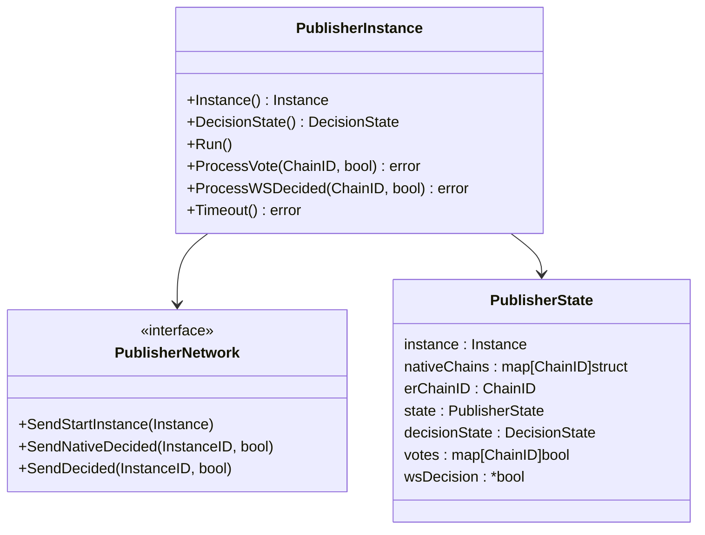
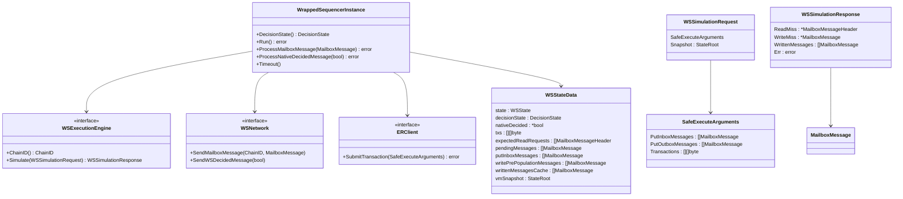
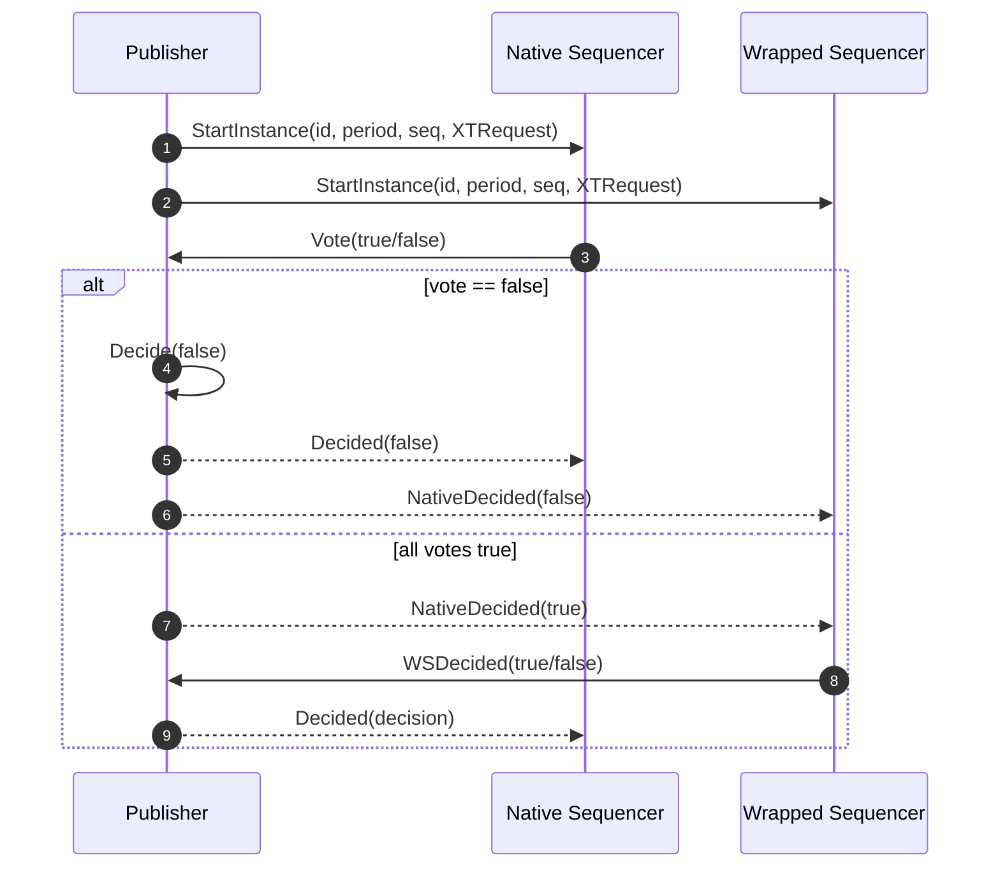
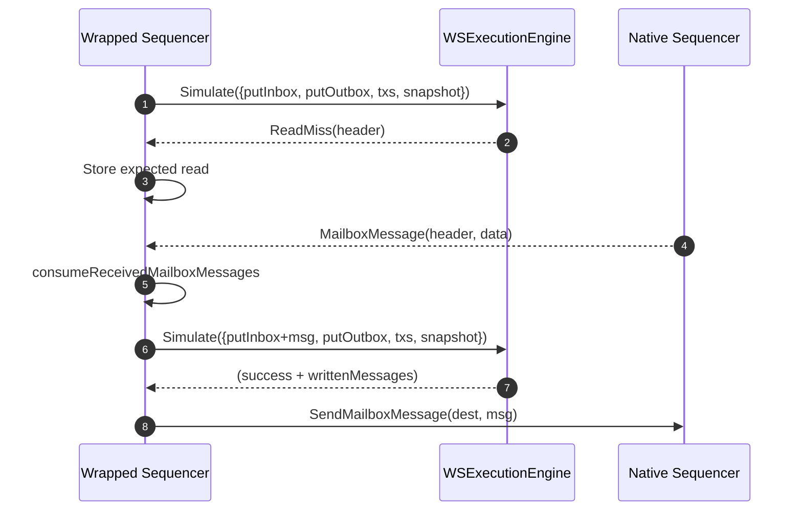
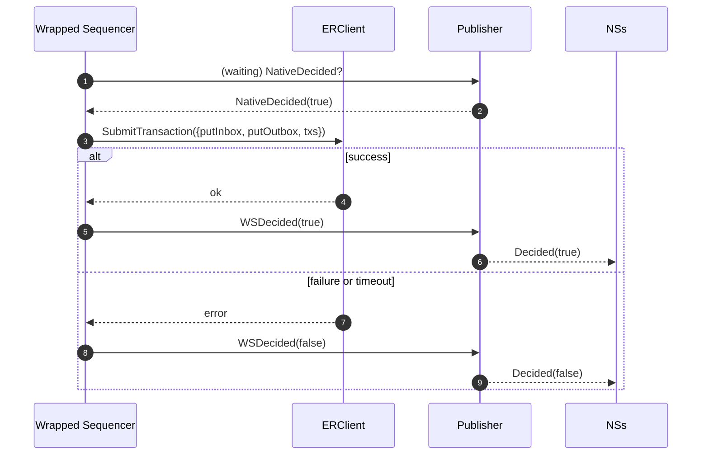

# Cross-Domain Composability Protocol (CDCP) — Minimal Spec Implementation

This package provides a minimal, testable implementation of the [CDCP](./../../cross_domain_composability_protocol.md) protocol that coordinates atomic execution between Compose native rollups and an external rollup.

## Publisher

The package exposes the `PublisherInstance` interface with the core logic for the CDCP publisher role.
It requires the following implementation dependency:
- `PublisherNetwork`: transports `StartInstance` to all participants,
`NativeDecided` to the WS, and final `Decided` messages to all NSs.

And provides the following methods:
- `Instance()`: returns the immutable `compose.Instance` metadata (ID, period, sequence number, chain list, request payload).
- `DecisionState()`: returns the current decision state (`Pending`, `Accepted`, `Rejected`).
- `Run()`: broadcasts the `StartInstance` message to every participant chain.
- `ProcessVote(sender, vote)`: records votes from native chains only, rejecting duplicates and ignoring non-native senders. Any `false` vote immediately decides and broadcasts rejection while `true` votes from all natives trigger `NativeDecided(true)` to the WS.
- `ProcessWSDecided(sender, decision)`: accepts exactly one decision from the ER chain. `false` finalizes the instance immediately (even if native votes are still missing); `true` is only valid after `NativeDecided(true)` has been sent and leads to acceptance.
- `Timeout()`: if still waiting for native votes, decides rejection and emits both `Decided(false)` and `NativeDecided(false)`.

The publisher validates the instance at construction time: the ER chain must belong to the instance and there must be at least one native chain.
Its state machine advances from WaitingVotes → WaitingWSDecided → Done, guarding impossible combinations (e.g. `WSDecided(true)` while still waiting for votes).



## Native Sequencer

Native sequencer behavior in CDCP is identical to the SCP sequencer role.
`NewNativeSequencerInstance` simply proxies to `scp.NewSequencerInstance`, so implementers can reuse the same execution engine, network adapter, and VM snapshot logic described in [`scp`](./../scp/README.md).

## Wrapped Sequencer

Wrapped sequencer (WS) logic is provided through the `WrappedSequencerInstance` interface.
It orchestrates mailbox-aware simulations of the external rollup transactions, waits for the native decision, and interacts with the external rollup client to submit the canonical transaction.
It requires the following implementation dependencies:
- `WSExecutionEngine`: performs mailbox-aware simulations of `safe_execute`, returning read/write misses plus the produced mailbox messages.
- `WSNetwork`: sends mailbox messages to native chains and reports `WSDecided` results back to the publisher.
- `ERClient`: submits `safe_execute` on the external rollup once the native decision allows it.

And provides the following methods:
- `DecisionState()`: returns the WS decision state.
- `Run()`: calls simulations against the VM snapshot:
  - Success: caches written mailbox messages, transitions to `WaitingNativeDecided`, and waits for publisher's `NativeDecided` message.
  - Error: transitions to `Done` and reports the error.
- `ProcessMailboxMessage(msg)`: buffers incoming mailbox messages for simulation; when a pending read is satisfied it moves the message into `PutInboxMessages` and re-runs the simulation.
- `ProcessNativeDecidedMessage(decided)`: deduplicates the publisher’s native decision and, if `true`, triggers the external rollup submission; `false` cancels execution.
- `Timeout()`: while not already waiting for the ER response, aborts and reports `WSDecided(false)`.



## Tests

To run the unit tests, use:

```bash
go test ./...
```

## Auxiliary Sequence Flows

### 1. Instance start, native votes, and WS decision



### 2. WS simulation, mailbox exchange, and re-run



### 3. Native decision, ER submission, and finalization


