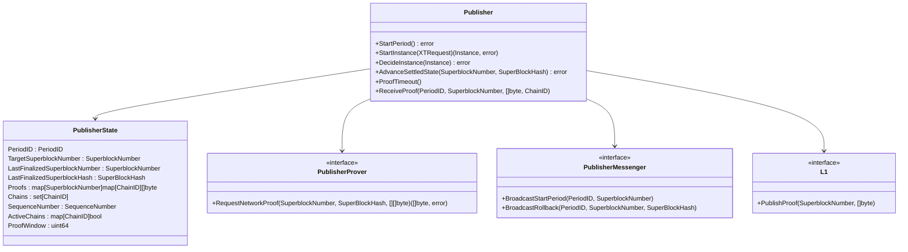
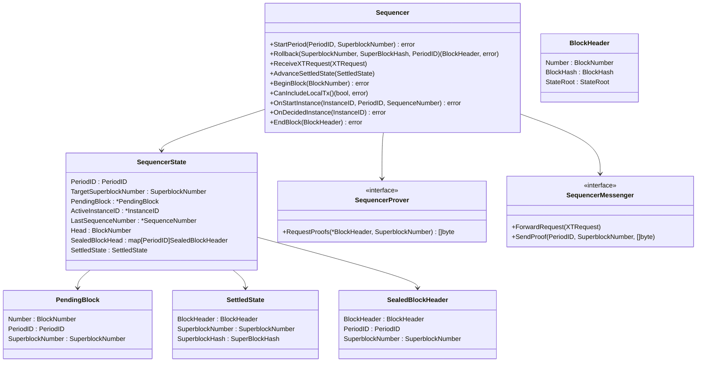
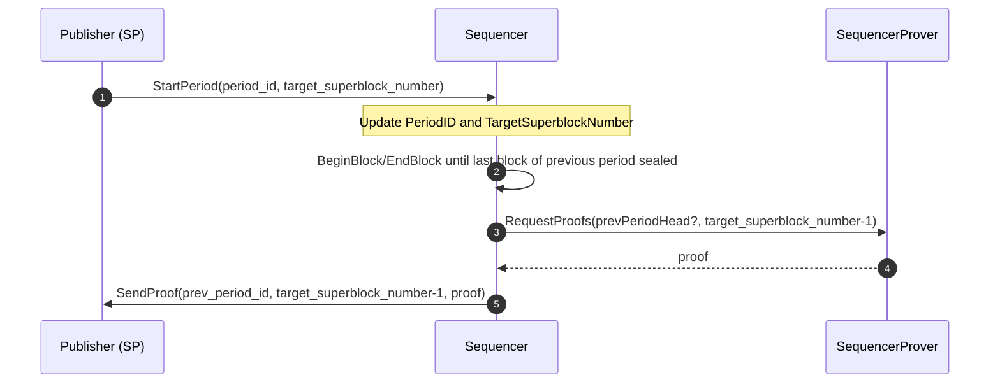
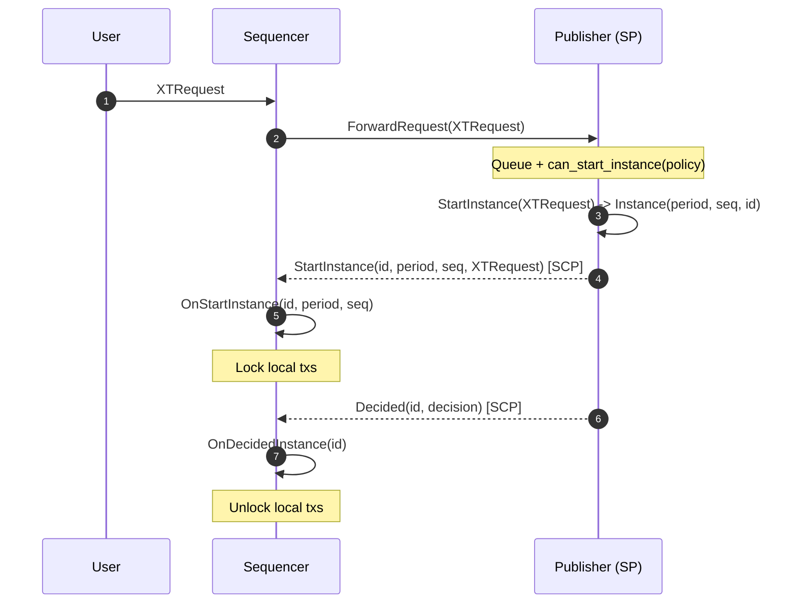
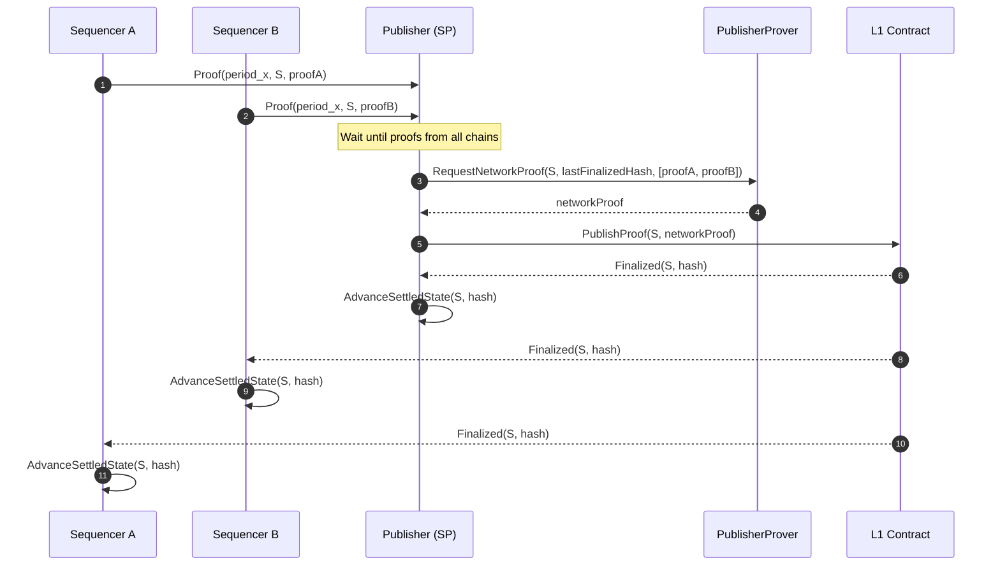
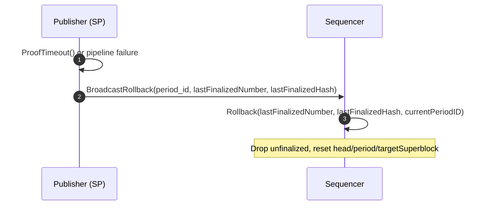

# Superblock Construction Protocol v2 (SBCP v2) — Minimal Spec Implementation

This package provides a minimal,
testable implementation of the [SBCP v2](./../../superblock_construction_protocol_v2.md)
protocol.

## Publisher

The package provides the `Publisher` interface with the core logic
for the publisher role in SBCP v2.
It requires the following implementation dependencies:
- `PublisherProver`: to request network proofs from collected sequencer proofs.
- `PublisherMessenger`: to broadcast period starts and rollbacks to sequencers.
- `L1`: to publish network proofs to the L1 contract.

And provides the following methods:
- `StartPeriod()`: should be called when a new period starts.
Note that the implementation is responsible for period timers
and for calling this method at the correct times, while the spec performs the transition logic.
- `StartInstance(XTRequest)`: attempts to start a new instance for the given `XTRequest`.
Again, note the implementation is responsible for managing a queue
of pending requests, and it should call the spec function to try to start a new instance.
- `DecideInstance(Instance)`: marks an instance as decided.
- `AdvanceSettledState(SuperblockNumber, SuperBlockHash)`: advances the settled
state whenever an L1 event is received by the implementation.
- `ProofTimeout()`: should be called by the implementation when the proof window expires.
Again, note that the implementation is responsible for the timer management.
- `ReceiveProof(PeriodID, SuperblockNumber, []byte, ChainID)`: called by the implementation
when a sequencer proof is received.



## Sequencer

The package also provides the `Sequencer` interface with the core logic
for the sequencer role in SBCP v2.
It requires the following implementation dependencies:
- `SequencerProver`: to request proofs for sealed blocks.
- `SequencerMessenger`: to forward XTRequests to the publisher and send proofs.

And provides the following methods:
- `StartPeriod(PeriodID, SuperblockNumber)`: called by the implementation
when a `StartPeriod` message is received from the SP.
- `Rollback(SuperblockNumber, SuperBlockHash, PeriodID)`: called by the implementation
when a `Rollback` message is received from the SP.
- `ReceiveXTRequest(XTRequest)`: called by the implementation
when an `XTRequest` is received from a user.
- `AdvanceSettledState(SettledState)`: called by the implementation
whenever an L1 event is received.

Furthermore, it adds a block building policy through the following methods:
- `BeginBlock(BlockNumber)`: should be called by the implementation whenever
it wants to start a new block, returning an error if block creation is not currently allowed (e.g. during an instance).
- `CanIncludeLocalTx()`: should be called by the implementation
to check whether local transactions can be included in the current block.
- `EndBlock(BlockHeader)`: should be called by the implementation
whenever it wants to seal the current block, returning an error if sealing can't be performed at the moment.
- `OnStartInstance(InstanceID, PeriodID, SequenceNumber)`: called by the implementation
when a `StartInstance` message is received from the SP, returning an error if the instance can't be started.
- `OnDecidedInstance(InstanceID)`: called by the implementation
when an instance gets decided, either due to a `Decided` message or due to a local `Vote(0)`.



## Tests

To run the unit tests, use the following command:

```bash
go test ./...
```


## Auxiliary Sequence Flows

### 1. Period start and sequencer settlement trigger



### 2. XTRequest forwarding and instance start/decision



### 3. Proof collection, network proof, and L1 publish




### 4. Rollback


