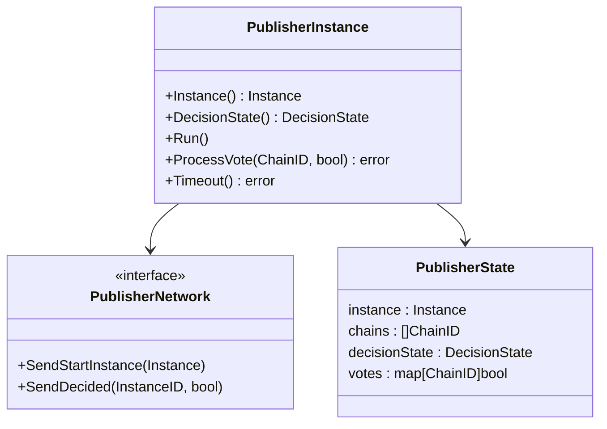
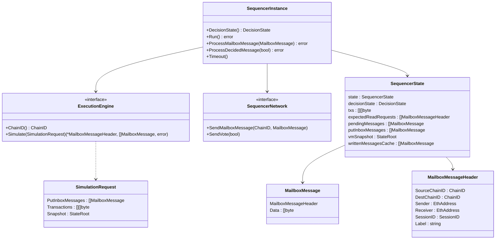
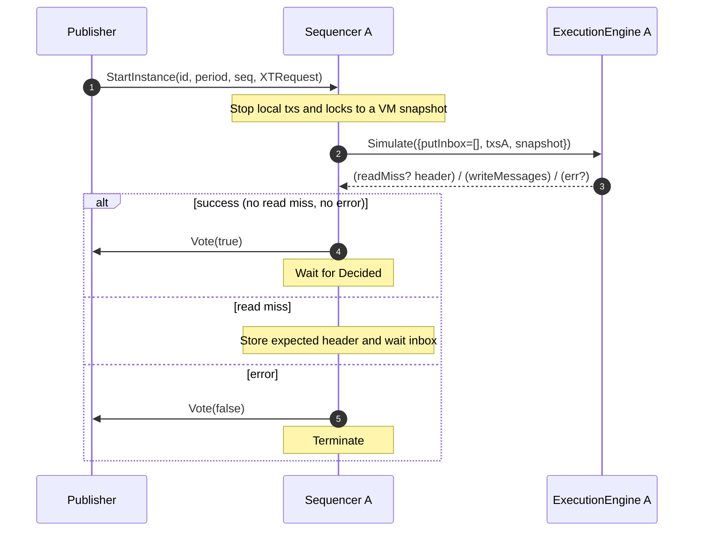
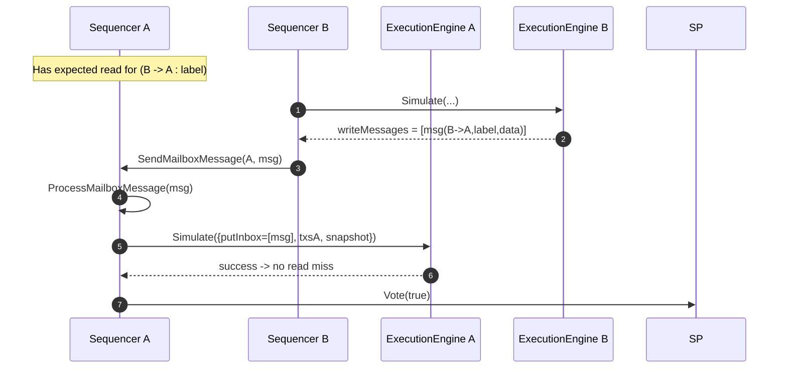
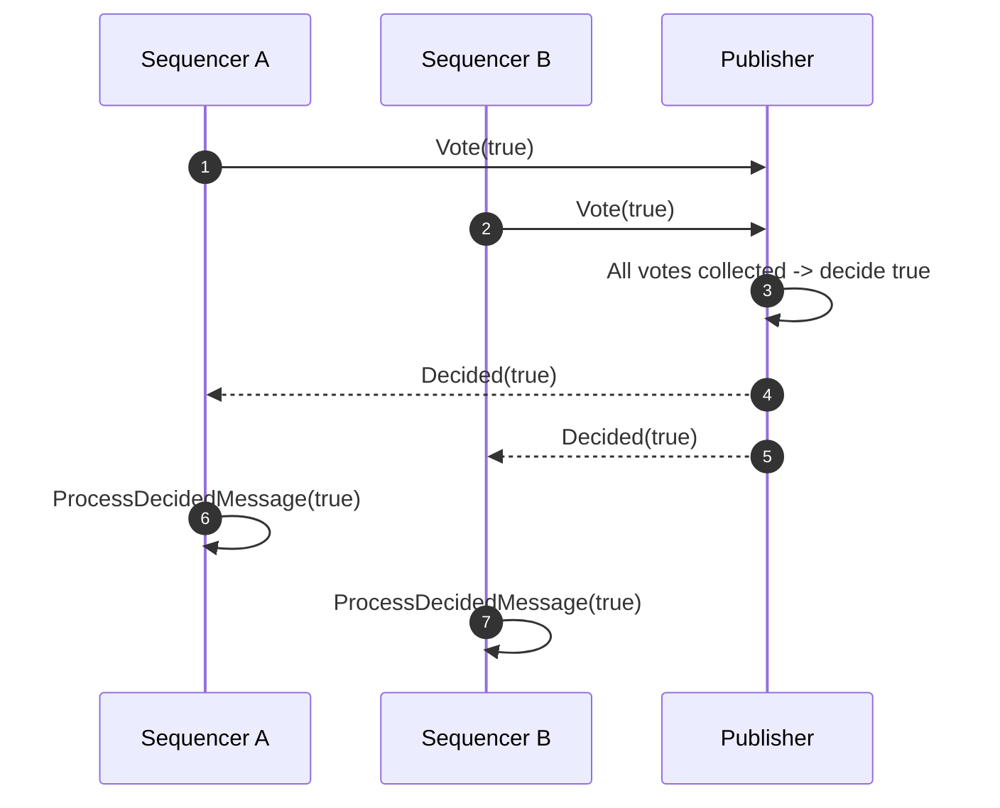
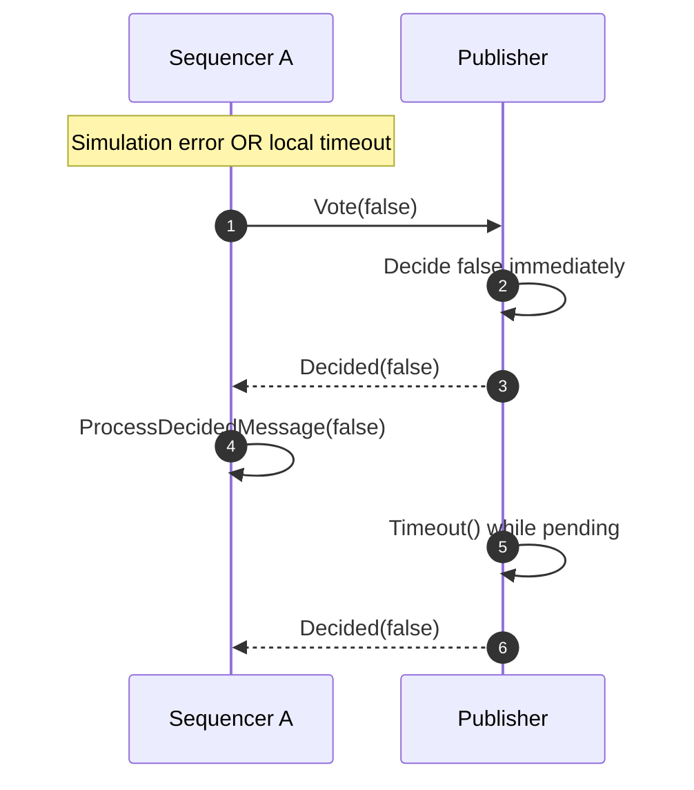

# Synchronous Composability Protocol (SCP) — Minimal Spec Implementation

This package provides a minimal,
testable implementation of the [SCP](./../../synchronous_composability_protocol.md)
protocol.

## Publisher

The package provides the `PublisherInstance` interface with the core logic
for the publisher role in SCP.
It requires the following implementation dependency:
- `PublisherNetwork`: to send `StartInstance` and `Decided` messages to all participants.

And provides the following methods:
- `Instance()`: returns the `compose.Instance` metadata (ID, period, sequence, request).
- `DecisionState()`: returns the current decision state (`Pending`, `Accepted`, `Rejected`).
- `Run()`: starts the instance by broadcasting `StartInstance`.
- `ProcessVote(sender, vote)`: processes a vote from a participant chain.
  - Any `false` vote decides the instance as rejected immediately.
  - All `true` votes decide the instance as accepted.
  - Duplicated votes are rejected; non-participant votes are ignored.
- `Timeout()`: decides the instance as rejected if still pending.



## Sequencer

The package also provides the `SequencerInstance` interface with the core logic
for the sequencer role in SCP.
It requires the following implementation dependencies:
- `ExecutionEngine`: to simulate transactions with mailbox-aware tracing.
- `SequencerNetwork`: to send mailbox messages to peers and votes to the publisher.

And provides the following methods:
- `DecisionState()`: returns the current decision state.
- `Run()`: starts the instance (upon the `StartInstance` message) and simulates the instance’s local transactions from a VM snapshot.
  - On success (no read miss, no error): sends `Vote(true)` and waits for `Decided`.
  - On read miss: stores the expected header and waits for inbox fulfillment, then re-simulates.
  - On other errors: sends `Vote(false)` and terminates.
- `ProcessMailboxMessage(msg)`: buffers incoming mailbox messages and, when any expected read is fulfilled, re-simulates.
- `ProcessDecidedMessage(decided)`: finalizes the instance as accepted/rejected.
- `Timeout()`: if not already waiting for decision or done, sends `Vote(false)` and terminates.



Notes:
- The `ExecutionEngine.Simulate` returns at most one read miss header per run; the sequencer loops by re-running after inbox fulfillment.
- `writtenMessagesCache` prevents duplicate mailbox sends when re-simulating.

## Tests

To run the unit tests, use the following command:

```bash
go test ./...
```

## Auxiliary Sequence Flows

### 1. Instance start and initial simulation



### 2. Mailbox exchange and re-simulation



### 3. Positive decision (all-true votes)



### 4. Negative decision (error or timeout)



