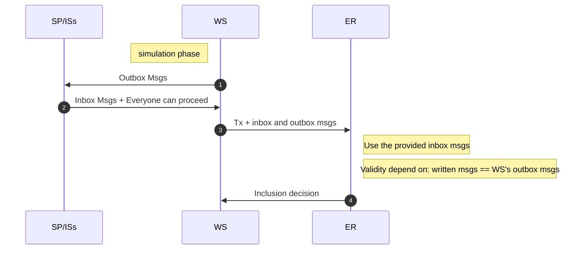
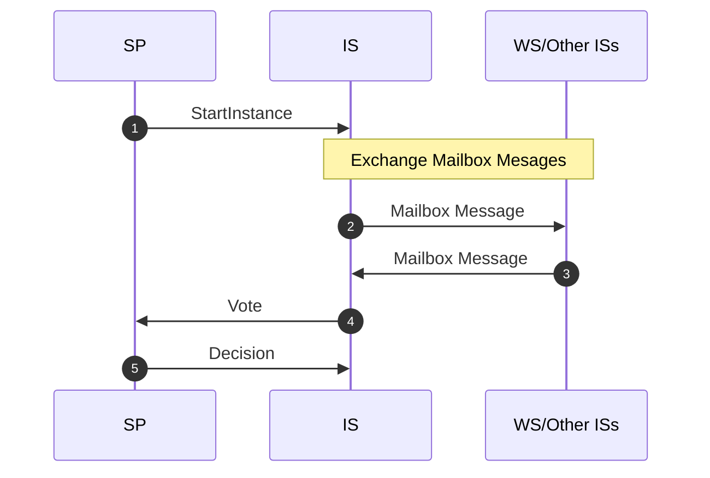
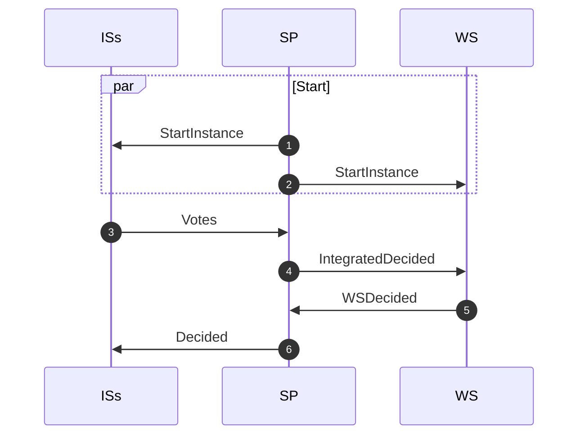
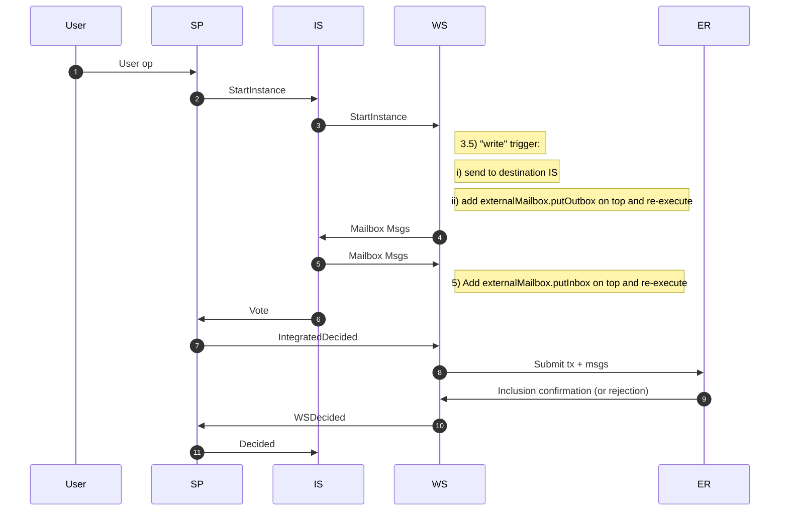
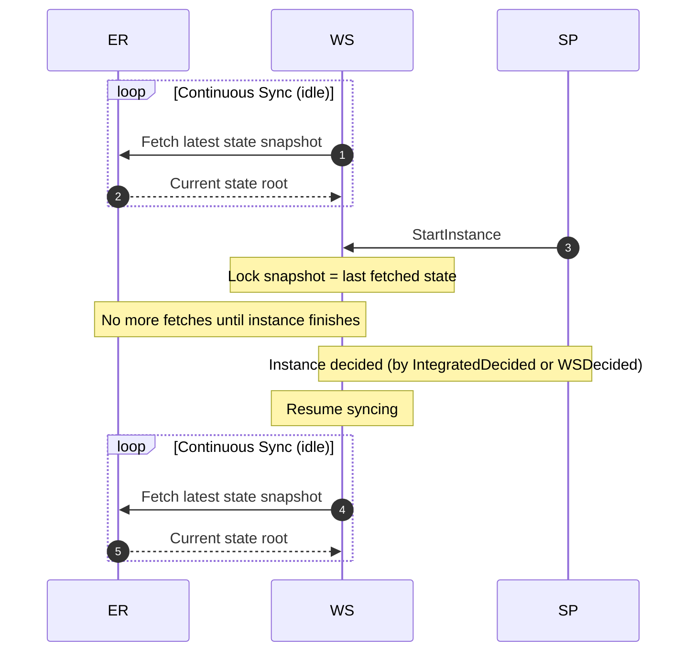

# Cross-Domain Composability Protocol (CDCP)

This protocol enables atomic composability between rollups of the Compose network and rollups outside of it.
The atomicity property refers to the guarantee that either both rollups successfully include transactions from a user's intent, or neither does.

## Table of Contents

- [Integrated vs. External Rollups](#integrated-vs-external-rollups)
- [System Model](#system-model)
- [Informal Protocol Intuition](#informal-protocol-intuition)
- [External Mailbox](#external-mailbox)
- [Protocol](#protocol)
  - [Integrated Sequencer (IS)](#integrated-sequencer-ns)
  - [Shared Publisher (SP)](#shared-publisher-sp)
  - [Wrapped Sequencer (WS)](#wrapped-sequencer-ws)
  - [Messages](#messages)
  - [Pseudocode](#pseudocode)
  - [WS—ER Sync](#wser-sync)
- [Transitive Dependency & Sessions](#transitive-dependency--sessions)
- [Settlement](#settlement)
  - [WS ZK Program](#ws-zk-program)
  - [SP Program Modifications](#sp-program-modifications)

## Integrated vs. External Rollups

To differentiate between types of rollups, we use the following terminology:
- **Integrated Rollups**: Rollups that are part of the Compose network.
- **External Rollups**: Rollups that are not part of the Compose network.

## System Model

The system encompasses 5 main components:
1. **User**: An entity that requests a cross-domain transaction execution.
2. **Shared Publisher (SP)**: The coordinator of the network that leads the execution of the protocol.
3. **Integrated Rollup Sequencers (ISs)**: Sequencers for the participating integrated rollups.
4. **External Rollup Client (ER)**: A client from the external rollup that accepts transactions to be included in a block.
5. **Wrapped Sequencer (WS)**: An entity that represents the participating external rollup sequencer in the Compose network, having access to the state and execution results of the external rollup.

The SP, ISs, and WS are part of the Compose network and are expected to have direct communication channels between them.
It's assumed that a user request is eventually delivered to the SP who will have the responsibility to initiate the protocol execution.
The WS is expected to have a communication channel with the ER.

For now, no byzantine faults are considered in the system.

We further assume partial synchrony with:
- a known upper bound on end-to-end delays between WS and ER, and
- a known upper bound on the ER clock skew relative to the WS clock.

These bounds are used to derive per-instance timeouts for ER inclusion.

## Informal Protocol Intuition

The WS will behave as it's the actual sequencer of the ER.
It will receive mailbox messages from other ISs, simulate its transactions,
produce outbox mailbox messages, and send them to the ISs. 
However, once the simulation phase is done,
the WS will need to send all this information to the ER, for the transaction
to be really included in a block.

Here is the delicate part of the protocol. 
We can't control the ER decision to include or not a valid transaction.
Still, the ER execution must match exactly the WS's one,
otherwise ISs would have executed on top of different messages
and would also produce different messages.
More concretely:
1. The ER must "receive" the same inbox messages the WS received.
2. The ER must produce the same outbox messages the WS produced.

Both (1) and (2) are solved in the same manner:
the WS provides all such information to the ER
who enforces a match with its execution.
Thinking in solidity and EVM logic,
in order to control the inclusion of the transaction,
we can control its validity
by binding the mailbox data to the WS's simulation.
This will be accomplished by the external mailbox,
which has an extra "write pre-population" feature that enforces
the ER's generated messages to match the WS's ones.





## External Mailbox

Integrated rollups are assumed to have the standard [`Mailbox`](./synchronous_composability_protocol.md) contract deployed.
External rollups will have a slightly modified version of the `Mailbox` contract.

In the `ExternalMailbox`, all messages are pre-populated by the WS:
- `read` is similar to the standard `Mailbox`, in which it's confirmed that the message exists and its data is returned.
- `write` is modified to ensure that the written message was pre-populated by the WS.

Next, we present the `ExternalMailbox` contract.

```text
CONTRACT ExternalMailbox:

    STRUCT MessageHeader:
        uint chainSrc
        uint chainDest
        address sender
        address receiver
        uint sessionId
        bytes label

    CONSTANT COORDINATOR (immutable address)

    STORAGE:
        array<uint> chainIDsInbox
        array<uint> chainIDsOutbox
        map<uint => bytes32> inboxRootPerChain
        map<uint => bytes32> outboxRootPerChain
        map<bytes32 => bytes> inbox
        map<bytes32 => bytes> outbox
        map<bytes32 => bool> createdKeys
        map<bytes32 => bool> usedKeys


    FUNCTION getKey(srcChainID, destChainID, sender, receiver, sessionId, label)
        RETURN keccak256(encode(srcChainID, destChainID, sender, receiver, sessionId, label))


    FUNCTION putInbox(srcChainID, sender, receiver, sessionId, label, data)
        REQUIRE caller == COORDINATOR

        key = getKey(srcChainID, currentChainID, sender, receiver, sessionId, label)

        IF createdKeys[key] == true:
            REVERT "Key already exists"

        inbox[key] = data
        createdKeys[key] = true


    FUNCTION putOutbox(destChainID, sender, receiver, sessionId, label, data)
        REQUIRE caller == COORDINATOR

        key = getKey(currentChainID, destChainID, sender, receiver, sessionId, label)

        IF createdKeys[key] == true:
            REVERT "Key already exists"

        outbox[key] = data
        createdKeys[key] = true


    FUNCTION read(srcChainID, sender, sessionId, label)
        key = getKey(srcChainID, currentChainID, sender, caller, sessionId, label)

        IF createdKeys[key] == false:
            REVERT MessageNotFound

        IF usedKeys[key] == true:
            REVERT MessageAlreadyUsed

        usedKeys[key] = true
        data = inbox[key]
        
        # Message is valid to be read.

        IF srcChainID not in inboxRootPerChain:
            append srcChainID to chainIDsInbox

        inboxRootPerChain[srcChainID] =
            keccak256(encode(inboxRootPerChain[srcChainID], key, data))

        RETURN data


    FUNCTION write(destChainID, receiver, sessionId, label, data)
        key = getKey(currentChainID, destChainID, caller, receiver, sessionId, label)

        IF createdKeys[key] == false:
            REVERT MessageNotFound

        IF usedKeys[key] == true:
            REVERT MessageAlreadyUsed

        IF hash(outbox[key]) != hash(data):
            REVERT MessageDataMismatch
            
        # Message is was pre-populated and so the write operation is valid to be executed.

        usedKeys[key] = true
        data = outbox[key]

        IF destChainID not in outboxRootPerChain[destChainID]:
            append destChainID to chainIDsOutbox

        outboxRootPerChain[destChainID] =
            keccak256(encode(outboxRootPerChain[destChainID], key, data))
```

> [!NOTE]
> In the Solidity contract, the storage layout of the `chainIDsInbox`,
> `chainIDsOutbox`, `inboxRootPerChain`, and `outboxRootPerChain` variables are
> used in the settlement protocol, which perform `eth_getProof` calls to retrieve
> the contract storage state. Thus, it's recommended that these varibles
> occupy the 1st, 2nd, 3rd and 4th slots, respectively.

> [!TIP]
> Space optimizations can be made to the contract by letting the `read` and `write` calls automatically remove used messages from storage.

## Protocol

Similarly to the SCP protocol, the SP initiates the execution by sending a start message, `StartInstance`, to ISs and WS.

---

### Integrated Sequencer (IS)

Then, each IS runs **exactly** the protocol rules of the [SCP protocol](./synchronous_composability_protocol.md). Namely:
1. Once it receives the `StartInstance` message from the SP, it starts a timer and selects the transactions from the `xD_transactions` list that are meant for its chain.
2. Then, it simulates its transactions, meaning that it executes them with a tracer at the mailbox, so that it can intercept `mailbox.Read` and `mailbox.Write` operations.
3. Once a `mailbox.Write` operation is intercepted, it sends a `Mailbox` message to the counterparty chain sequencer (either the WS or another IS).
4. Whenever a `mailbox.Read` operation is triggered and fails, it waits until a mailbox message is received.
5. Once a mailbox message is received from another sequencer, it adds a `mailbox.putInbox' transaction with it, placing it before the main transaction in the transaction list. Then, it goes back to step 2, re-starting the transaction simulation.
6. In case the transaction simulation is successful, it stops the timer (as it no longer will be used) and sends a `Vote(1)` message to the SP, indicating its willingness to include the transaction.
7. In case there's a timeout (before a `Vote` message has been sent) or if the transaction simulation fails but not due to a mailbox read error, it sends a `Vote(0)` message to the SP, indicating the impossibility of including the transaction, and terminates.
8. In case a `Decided(1)` message is received from the SP, it adds all `mailbox.putInbox' transactions created and the main transaction to the block, and terminates.
9. In case a `Decided(0)` message is received from the SP, it removes all `mailbox.putInbox' transactions created and the main transaction from the block, reverting to the previous state, and terminates.

**Sequence Diagram - IS View**


---
### Shared Publisher (SP)

The Shared Publisher (SP) runs a slightly modified version of the SCP protocol:
1. It sends a `StartInstance` message to the appropriate sequencers, starts a timer, and waits for ISs' `Vote` messages.
2. If a timeout occurs or if a `Vote(0)` message is received (indicates a failure), it sends a `Decided(0)` message to the ISs and a `IntegratedDecided(0)` message to the WS, and terminates.
3. If it receives a `Vote(1)` message from all ISs, it stops the timer (as it not longer will be used) and sends a `IntegratedDecided(1)` message to the WS, indicating that the ISs are willing to proceed.
4. Once a `WSDecided(b)` message is received from the WS, it sends a `Decided(b)` message indicating the result to the ISs, and terminates.

Note that, from the above, the SP works as a middle layer between the ISs and WS.
It indicates the viability results from the ISs to the WS, who is then allowed to communicate with the external rollup for including its transaction.
Once the WS receives a response, it indicates the result to the SP, who transmits the result back to the ISs.

**Sequence Diagram - SP View**


---

### Wrapped Sequencer (WS)

The Wrapped Sequencer (WS) has the following rules:
1. (Same as IS) Once it receives the `StartInstance` message from the SP, it starts a timer and selects the transactions from the `xD_transactions` list that are meant for its chain.
2. (Same as IS) Then, it simulates its transactions, meaning that it executes them with a tracer at the mailbox, so that it can intercept `mailbox.Read` and `mailbox.Write` operations.
3. Whenever a `externalMailbox.Write` operation is intercepted and fails:
  - It sends a `Mailbox` message to the counterparty chain sequencer.
  - It creates a `externalMailbox.putOutbox` transaction and adds it locally to the transaction list, placing it before the main transaction.
  - Then, it re-starts the transaction simulation going back to step 2.
4. (Same as IS) Whenever a `mailbox.Read` operation is triggered and fails, it waits until a mailbox message is received.
5. (Same as IS) Once a mailbox message is received from another sequencer, it adds a `mailbox.putInbox' transaction with it, placing it before the main transaction in the transaction list. Then, it goes back to step 2, re-starting the transaction simulation.
6. In case the transaction simulation is successful, it waits for a `IntegratedDecided` message from the SP.
7. In case there's a timeout (before a `WSDecided` message has been sent) or if the transaction simulation fails but not due to a mailbox write or read error, it sends a `WSDecided(0)` message to the SP, indicating failure and terminates.
8. If a `IntegratedDecided(0)` message is received from the SP, it removes its transaction (and any created `externalMailbox`) and terminates.
9. If a `IntegratedDecided(1)` message is received from the SP and its local transaction simulation is successful, it stops the timer (as it no longer will be used) and sends a special transaction to the ER, which populates the mailbox and executes the transaction atomically.
10. If the ER transaction fails, it sends a `WSDecided(0)` message to the SP, indicating failure and terminates.
11. If the ER transaction is successful, it sends a `WSDecided(1)` message to the SP, indicating success and terminates.

The special transaction to the ER, `safe_execute`, allows an atomic execution of the mailbox staging and the main transaction.
For each instance, the WS passes a timeout parameter, derived from the period and the delay/clock-skew bounds above, so that late inclusions on the ER side revert.
It has the following pseudo-code:
```text
FUNCTION safe_execute(inboxMsgs, outboxMsgs, txs, timeout) onlyInvocableByWS:

    # 0. Enforce instance timeout
    IF block.timestamp > timeout:
        REVERT Timeout

    # 1. Pre-populate inbox messages in ExternalMailbox
    FOR each msg IN inboxMsgs:
        ExternalMailbox.putInbox(msg...)

    # 2. Pre-populate outbox messages in ExternalMailbox
    FOR each msg IN outboxMsgs:
        ExternalMailbox.putOutbox(msg...)

    # 3. Execute the transactions
    FOR each tx IN txs:
        CALL tx()
```

**Full Sequence Diagram**



---

### Messages

Besides the messages already defined in the [SCP protocol](./synchronous_composability_protocol.md) 
(`StartInstance`,`MailboxMessage`,`Vote`,`Decided`),
we have the following additional messages:

```protobuf
message IntegratedDecided {
    uint64 SuperblockNumber = 1;
    bytes xTid = 2;
    bool Decision = 3;
}
message WSDecided {
    uint64 SuperblockNumber = 1;
    bytes xTid = 2;
    bool Decision = 3;
}
```

### Pseudocode

**CDCP Algorithm for the Shared Publisher**

```py
procedure start(instance, erChain):
    integratedChains = instance.chains - {erChain}
    votes = {}
    state = WAIT_NATIVE
    timer = start_timer()

    broadcast(integratedChains, StartInstance(instance))
    send(erChain, StartInstance(instance))

on Vote(chainID, vote):
    if state != WAIT_NATIVE or chainID not in integratedChains:
        return
    if chainID in votes:                     
        return # duplicate vote

    votes[chainID] = vote

    if vote == 0:
        stop_timer(timer)
        broadcast(integratedChains, Decided(0))
        send(erChain, IntegratedDecided(0))
        state = DONE
        return

    if len(votes) == len(integratedChains):
        stop_timer(timer)
        send(erChain, IntegratedDecided(1))
        state = WAIT_WS

on WSDecided(from, decision):
    if from != erChain or state == DONE:
        return
    if decision == 1 and state == WAIT_NATIVE:
        # should not happen as WS can only vote after it receives a IntegratedDecided
        error("WSDecided(1) before IntegratedDecided")

    broadcast(integratedChains, Decided(decision))
    state = DONE
    # Note that a WS failure is final even if ISs votes are still pending.

on timer_fired(timer):
    if state == WAIT_NATIVE:
        broadcast(integratedChains, Decided(0))
        send(erChain, IntegratedDecided(0))
        state = DONE
```

**CDCP Algorithm for the Wrapped Sequencer**
```py
state = SIMULATING
txs = transactions_for_chain(xReq, erChain)
putInbox = []          # messages that will be pre-populated via putInbox
putOutbox = []         # messages that will be pre-populated via putOutbox
pendingMailbox = []    # mailbox messages received from other chains
expectedReads = []     # read requests produced by simulations
writtenCache = set()   # prevents re-broadcasting identical writes
integratedDecided = None
# fixed state-root snapshot which every simulation should be executed on top
state_root = get_current_state_root()
timeout = compute_er_timeout(instance_metadata)  # based on Δ_delay, Δ_clock

procedure start():
    run_simulation()

procedure run_simulation():
    if state != SIMULATING:
        return

    resp = simulate_safe_execute(state_root, putInbox, putOutbox, txs, timeout)

    if resp.error exists:
        send(SP, WSDecided(0))
        state = DONE
        return

    send_new_write_messages(resp.writtenMessages)

    if resp.readMiss exists:
        expectedReads.append(resp.readMiss)
        consume_mailbox_and_retry()
        return

    if resp.writeMiss exists:
        putOutbox.append(resp.writeMiss)
        run_simulation()
        return
    
    # Else -> success
    state = WAIT_NATIVE_DECIDED
    attempt_er_call()

procedure send_new_write_messages(messages):
    for msg in messages:
        if msg not in writtenCache:
            writtenCache.add(msg)
            send_mailbox(msg.destChainID, msg)

procedure on MailboxMessage(msg):
    if state != SIMULATING:
        return
    pendingMailbox.append(msg)
    consume_mailbox_and_retry()

procedure consume_mailbox_and_retry():
    consumed = false
    for expected in expectedReads:
        match = find_matching_message(expected, pendingMailbox)
        if match exists:
            remove(expectedReads, expected)
            remove(pendingMailbox, match)
            putInbox.append(match)
            consumed = true
    if consumed:
        run_simulation()

procedure on IntegratedDecided(decision):
    if integratedDecided is not None or state == DONE:
        return
    integratedDecided = decision
    attempt_er_call()

procedure attempt_er_call():
    if state != WAIT_NATIVE_DECIDED or integratedDecided is None:
        return

    if integratedDecided == 0:
        state = DONE
        return    # ISs already rejected

    state = WAIT_ER_RESPONSE
    err = submit_safe_execute_to_ER(putInbox, putOutbox, txs, timeout)
    if err:
        send(SP, WSDecided(0))
    else:
        send(SP, WSDecided(1))
    state = DONE

procedure on_timeout():
    if state in {SIMULATING, WAIT_NATIVE_DECIDED}:
        send(SP, WSDecided(0))
        state = DONE
```

---

### WS—ER Sync

For simulating transactions, the WS needs a snapshot of the ER's state, which influences the contents of any message written to other chains.
Once the `safe_execute` tx is submitted to the ER, it will be re-executed with the ER's current state, and it will only succeed if the written messages are the same as the ones simulated (pre-populated in the ExternalMailbox).
Therefore, to maximize the probability of success, the WS should have the most recent state possible.

However, note that the state can't be updated during the protocol's execution, as it could change the simulation results (previously written messages).
Thus, the protocol initiation should also lock the chain's state being used (as shown in the pseudocode above).



## Transitive Dependency & Sessions

In its initial version, the protocol only supports one external rollup.

In future versions, many will be supported.
Due to the settlement dependency, a proper session management system will be required not to create settlement deadlocks, that could allow double-spending and other attacks.

## Settlement

Following the SBCP (v2), at the end of the superblock period, sequencers submit an `AggregationProof` to the SP,
commiting to their final state and to the associated mailbox roots.
With an external rollup, the mailbox roots from integrated rollups should also be compared to the roots stored in the ER.

Therefore, the WS should provide the SP with the ER's external mailbox roots at settlement time.
While the WS's proof does not need to attest to the ER's correct state execution, it should
at least prove that there's a certain mailbox state associated with a certain ER block hash and number.

### WS ZK Program

For that, the WS zk program input is structured as:
```rust
pub struct Input {
  WitnessData, // With similar data as in the ZK Range program input
  pub state_root: B256,
  
  // Inbox
  pub mailbox_inbox_chains_len: GetProofOutput
  pub mailbox_inbox_chains:     GetProofOutput, // List of chains in inbox
  pub mailbox_inbox_roots:      GetProofOutput, // List of inbox root per chain
  
  // Outbox
  pub mailbox_outbox_chains_len:    GetProofOutput
  pub mailbox_outbox_chains:        GetProofOutput, // List of chains in outbox
  pub mailbox_outbox_roots:         GetProofOutput, // List of outbox root per chain
}

pub struct GetProofOutput {
  pub address: B256,
  pub accountProof: Vec<B256>, // Merkle proof
  pub storageHash: B256,
  pub storageProof: Vec<StorageProof>
}

pub struct StorageProof {
  pub key: B256,
  pub value: B256,
  pub proof: Vec<B256>, // Merkle proof
}
```

It consists of a `state_root` block reference and several [`eth_getProof`](https://www.quicknode.com/docs/ethereum/eth_getProof)
outputs for fetching the mailbox state described in the `ExternalMailbox` contract.

More precisely:
- The `state_root` field represents the last ER's block state root associated to the superblock period.
- The `mailbox_inbox_chains_len` represents the output of calling `eth_getProof` for the slot `0x0`, which stores the length of the `chainIDsInbox` array (`len_inbox`).
- Similarly, `mailbox_outbox_chains_len` represents the call at slot `0x1` for the length of the `chainIDsOutbox` array (`len_outbox`).
- Given these lengths, the WS can fill `mailbox_inbox_chains` which represents a call for `len_inbox` items with keys `key(i) = base + i`, where `base = keccak256(0x0)`.
- The same goes for `mailbox_outbox_chains`, with `base = keccak256(0x1)`.
- The `StorageProof.value`, for the above calls items, represent the chain IDs that have messages in the inbox and outbox, respectively.
- Finally, `mailbox_inbox_roots` and `mailbox_outbox_roots` represent calls for getting the data in `inboxRootPerChain` and `outboxRootPerChain`, respectively.
- Each is called for `len_inbox` and `len_outbox` items, respectively, with keys `key(chainID) = keccak256(chainID || base)` for `base` as `0x02` and `0x03`, respectively.

The program will produce the following output, committing to the mailbox state root, as defined in the [settlement layer spec](./settlement_layer.md).
```rust
pub struct Output {
  pub state_root:  B256,
  pub mailbox_contract: B256,
  pub mailbox_root:     B256,
}
```

Once a proof is generated, the WS submits it to the SP along with the list of chain-specific inbox and outbox roots, as other integrated sequencers do.

**WS ZK Program Pseudocode**
```py
procedure WS_ZK_Program(input: Input) -> Output:
    // Confirm state_root exists in the ER contract
    ensure_l2_block_exists(input.witness_data, input.state_root)
    
    // Verify that mailbox is consistent and get it
    mailbox_addr = verify_consistency_and_return_mailbox_address(input)
    
    // Verify proofs
    verify_get_proof(input.mailbox_inbox_chains_len, input.state_root)
    verify_get_proof(input.mailbox_inbox_chains, input.state_root)
    verify_get_proof(input.mailbox_inbox_roots, input.state_root)
    verify_get_proof(input.mailbox_outbox_chains_len, input.state_root)
    verify_get_proof(input.mailbox_outbox_chains, input.state_root)
    verify_get_proof(input.mailbox_outbox_roots, input.state_root)
    
    // Reconstruct mailbox root
    inbox_len = input.mailbox_inbox_chains_len.storageProof[0].value
    outbox_len = input.mailbox_outbox_chains_len.storageProof[0].value
    inbox_chains = [sp.value for sp in input.mailbox_inbox_chains.storageProof]
    outbox_chains = [sp.value for sp in input.mailbox_outbox_chains.storageProof]
    ensure inbox_len = len(inbox_chains)
    ensure outbox_len = len(outbox_chains)
    
    inbox_roots = [sp.value for sp in input.mailbox_inbox_roots.storageProof]
    outbox_roots = [sp.value for sp in input.mailbox_outbox_roots.storageProof]
    ensure inbox_len = len(inbox_roots)
    ensure outbox_len = len(outbox_roots)
    
    mailbox_root = compute_mailbox_root(inbox_chains, inbox_roots, outbox_chains, outbox_roots)
    
    commit(Output{
    state_root: input.state_root,
    mailbox_contract: mailbox_addr,
    mailbox_root: mailbox_root
    })
```


### SP Program Modifications

The SP zk program should be adjusted to accept the above program's output
as well as a list of mailbox roots provided by the WS (exactly as other ISs do)
as additional inputs.
The SP then needs to:
- Verify the proof for `Output`.
- Verify that `Output.mailbox_contract` matches the expected ExternalMailbox address for the WS.
- As done for other rollups, verify that the `Output.mailbox_root` is correct considering list of mailbox roots, and match these roots against integrated ones. 


## Future Work

### Partial Rollback with Multiple CDCP Instances

When there are multiple CDCP instances within a single settlement window, a problematic scenario can arise:
- Instance 1 succeeds on both ER and the integrated rollups.
- Instance 2 appears to succeed (WSDecided(1) and Decided(1)), but later the ER fails to persist the corresponding state/mailbox roots.
- At settlement time, the SP detects a mismatch for instance 2 and must trigger a rollback.

The challenge is that the correct rollback point is logically **“right after instance 1”**, and not the last fully finalized superblock for the whole network (which is currently defined).
Rolling back all activity since the previous period’s superblock would incorrectly drop the successfully executed instance 1.

**Possible Direction: Micro-Superblock Subcheckpoints** 

A possible solution is to introduce **micro-superblock (microSB) subcheckpoints** at each composability instance boundary:
- Each composability instance (including both SCP and CDCP instances) induces a microSB checkpoint, ordered by sequence number, that commits to:
  - the per-rollup state roots immediately after the instance, and
  - the mailbox roots that reflect the instance’s messages.
- These microSBs form a chain of subcheckpoints within (or across) periods, ordered exactly as the protocol executes instances.

For CDCP specifically:
- Integrated sequencers could attach their local `state_root` (or equivalent checkpoint root) to their `Vote(1)` for the instance.
- The WS already tracks the ER’s relevant `state_root` through its ZK program.
- The SP stores this per-instance bundle as a **microSB checkpoint**.

At settlement time:
- If all microSBs for a period can be proved consistent (including the ER mailbox roots), the SP can advance the network to the last microSB as usual.
- If a later instance (e.g., instance 2) turns out to be inconsistent, the SP can instruct integrated sequencers and WS to **roll back only to the last valid microSB**, e.g., the checkpoint after instance 1.

Note that microSB checkpoints can be used to all composability instances (both SCP and CDCP), with the exact same rules as described above.
 
