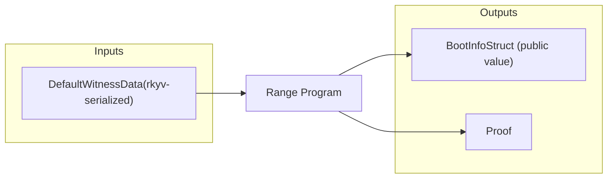
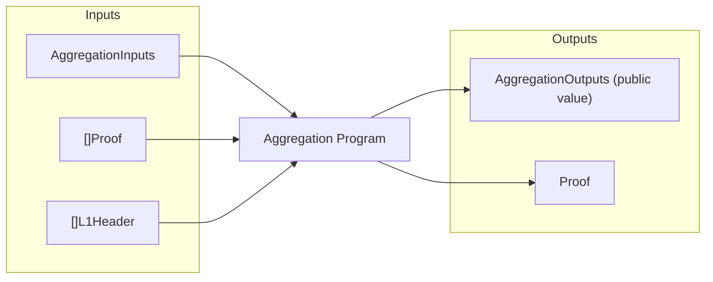
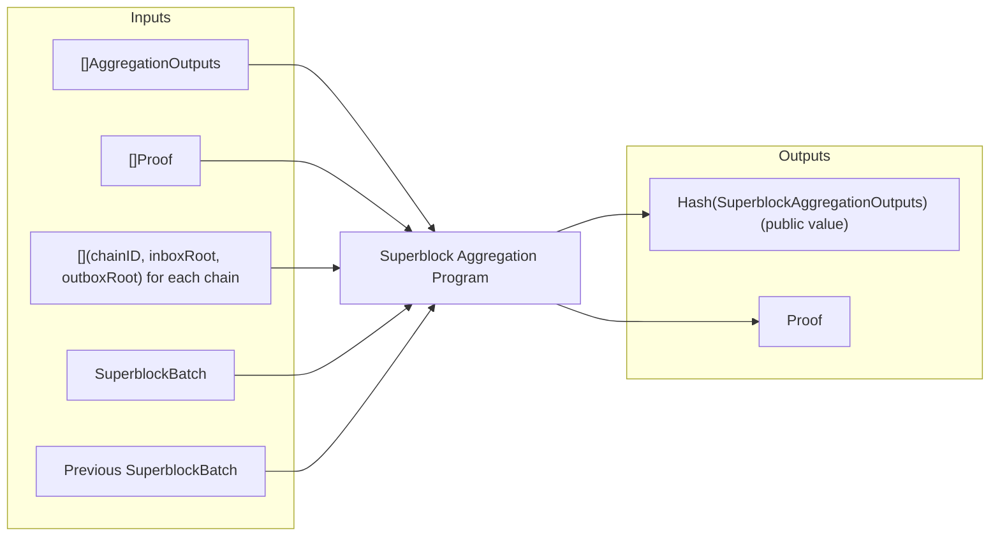
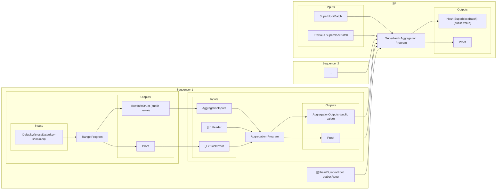

# Settlement Layer <!-- omit from toc -->

## Table of Contents <!-- omit from toc -->

- [Mechanism](#mechanism)
- [Batch Synchronization](#batch-synchronization)
- [Superblock](#superblock)
- [Superblock Validation Rules](#superblock-validation-rules)
- [Contract](#contract)
- [Protocol](#protocol)
  - [1. Range Program](#1-range-program)
    - [Mailbox Root](#mailbox-root)
  - [2. Aggregation Program](#2-aggregation-program)
  - [3. Network Aggregation Program](#3-network-aggregation-program)
  - [Full Flow](#full-flow)
- [Superblock and L2 Block Safety Levels](#superblock-and-l2-block-safety-levels)
- [Soft-Confirmations](#soft-confirmations)
- [Publishing](#publishing)
- [Concerns and mitigations](#concerns-and-mitigations)
  - [1. Liveness coupling](#1-liveness-coupling)

## Mechanism

We follow a ZK approach, i.e. the validity of the state transition of the network will be proven by a ZK proof.
To guarantee atomicity and synchronous composability, all interacting rollups must settle together in L1, i.e. in a single transaction.
Scalability will be provided by two means:
1. In parallel, each sequencer will be responsible for providing a valid ZKP about the validity of a batch of L2 blocks along with its mailbox activity.
2. Once all proofs are received, the SP will aggregate them, ensuring their correctness, and check that the inter-rollup communication was valid. As a result, it produces a unique ZKP that can be verified on chain in constant time.

To encapsulate all the state transition information about each rollup, the SP will prove a **SuperblockBatch** object, which is discussed in more detail [below](#superblock).

The validity of rollup blocks is proven by building on top of the [Succinct](https://succinctlabs.github.io/op-succinct/introduction.html) framework.
In such a framework, once a certain range of blocks is produced, a [STARK](https://eprint.iacr.org/2018/046.pdf) ZK proof is generated, validating the entire range.
Once enough ranges are proven, a STARK-to-SNARK aggregation program produces a succinct SNARK proof attesting to the validity of the complete batch.
The transformation to a SNARK proof is important as it can be efficiently verified on-chain with a simple bilinear-pairing

This mechanism will be adjusted so that sequencers can also prove their mailbox activity regarding other chains.
Moreover, the SP will execute a final ZK program that verifies each L2 batch proof and the consistency in mailbox activity.

## Batch Synchronization

| Config Field | Value |
|--------|-------|
| Block Time | 12 seconds |
| Ethereum Epochs Batch Factor | 10<br>(batch is triggered whenever Mod(Curr Eth Epoch, 10) == 0) |

The settlement mechanism proves activity for a batch of blocks.
Therefore, sequencers must be synchronized on when a batch starts and ends.
For that, rollups will maintain common block time and batching logic.

Block time is set to 12 seconds according to the [SBCP](./superblock_construction_protocol.md) protocol.

Batch is synchronized according to Ethereum epochs, i.e. Ethereum is used as a common clock.
Each sequencer continuously listens to L1 epochs and sets a new batch to start whenever the current L1 epoch number is divisible by 10.
Once a new batch starts, the proving pipeline (described next) starts for the previous batch.
Note that this defines a batch in terms of time, and not in a number of blocks.
Thus, even if a rollup misses a block, it will still prove its batch for the correct time window.

> [!TIP]
> Why is such synchronization necessary?<br>
> Suppose two rollups have the same block time but different batching trigger logic.
> For example, suppose rollup A creates block X and rollup B creates block Y, both in the same slot.
> However, A proves the range [X-B, X] while B proves the range [Y+1-B, Y+1].
> Once mailbox consistency is checked, the mailbox state of B will be slightly more advanced than A's, and thus the mailbox consistency check may fail.

## Superblock

A superblock has the following format:

```solidity
struct SuperblockBatch {
  uint256 superblockNumber;           // Sequential superblock number
  bytes32 parentSuperblockBatchHash;  // Hash of the previous superblock
  RollupStateTransition[] rollupST;   // State transition information, one for each rollups
}

struct RollupStateTransition {
  bytes32 l1Head;           // Latest L1 head observed by the rollup
  bytes32 l2PreRoot;        // Pre-execution state root
  bytes32 l2PostRoot;       // Post-execution state root
  bytes32 l2BlockNumber;    // New L2 block Number
  bytes32 rollupConfigHash; // Unique rollup identifier
}
```

Note that, following the batching approach, a `SuperblockBatch` object may represent the state transition of an entire batch. Namely:
- `superblockNumber` is a sequential number that increases by one for each new `SuperblockBatch`.
- `parentSuperblockBatchHash` anchors to the hash of the previous submitted `SuperblockBatch`.
- `rollupST.l1Head` is the latest L1 head observed by the rollup, for L1 composability purposes.
- `rollupST.l2PreRoot` is the state root of the L2 before the first block of the batch.
- `rollupST.l2PostRoot` is the state root of the L2 after the last block of the batch.
- `rollupST.l2BlockNumber` is the L2 block number of the last block of the batch.
- `rollupST.rollupConfigHash` is the hash of the rollup's configuration, which uniquely identifies it.


> [!TIP]
> While this batching methodology may seem odd, it's aligned with the ZK program's standards for proving a longer time-window of changes in a space-optimized manner.

## Superblock Validation Rules

This section presents the validation rules for a `SuperblockBatch`.
Let `sb` be the superblock being validated, and `previous` the last superblock.
Also, for each `RollupStateTransition`, let `rst` be the proposed rollup state transition and `previousRst` its last state transition.


| Rule Number | Name                              | Description                                                                                                                                                                                                                                                                                                                                                                              |
|-------------|-----------------------------------|------------------------------------------------------------------------------------------------------------------------------------------------------------------------------------------------------------------------------------------------------------------------------------------------------------------------------------------------------------------------------------------|
| Superblock  |                                   |                                                                                                                                                                                                                                                                                                                                                                                          |
| 1           | **Superblock Number Progression** | `sb.superblockNumber = previous.superblockNumber + 1`                                                                                                                                                                                                                                                                                                                                    |
| 2           | **Superblock Parent Consistency** | `sb.parentSuperblockBatchHash = getSuperblockHash(previous)`                                                                                                                                                                                                                                                                                                                                  |
| L2 Block    |                                   |                                                                                                                                                                                                                                                                                                                                                                                          |
| 3           | **Valid Chain**                 | A rollup with the `rst.rollupConfigHash` identifier hash must be registered                                                                                                                                                                                                                                                                                                                                                        |
| 4           | **L2 Block Parent Consistency**   | `rst.l2PreRoot = previousRst.l2PostRoot`                                                                                                                                                                                                                                                                                                                                               |
| 5           | **L2 State Transition Validity**  | There must be a valid ZKP for a batch for the chain `rst.rollupConfigHash` that builds on top of the state root `rst.l2PreRoot` and ends at state root `rst.l2PostRoot`, with last block number `rst.l2BlockNumber`, and latest l1 head `rst.l1Head`.                                                                                                                                                                                    |
| Cross-chain |                                   |                                                                                                                                                                                                                                                                                                                                                                                          |
| 6           | **Mailbox Consistency**           | There must be a valid ZKP for the set of L2 batches of the list `sb.rollupST`, such that, for each L2 batch `st`, it's true that:<br> 1. $\forall\, m \in$ `st.inbox`, $: m\in$ `st'.outbox` where $st'$ is the destination chain<br> 2. $\forall\, m \in$ `st.outbox`, $: m\in$ `st'.inbox` where $st'$ is the source chain |

As we shall present in the [protocol](#protocol), a single ZKP will be produced, attesting to the validity of all above rules.

## Contract

This section describes how the superblock proof is verified on-chain.

In the op-succinct framework, the settlement contract's [`prove`](https://github.com/succinctlabs/op-succinct/blob/b6a67787ba53b8f8251ce8b3ffaf0fe2d0d1294f/contracts/src/fp/OPSuccinctFaultDisputeGame.sol#L367)
function accepts an `AggregationOutputs` object (which has similar data to `RollupStateTransition`) and a proof, and verifies it with the program's verification key.
This is done by any default op-succinct rollup.

On our side, a common unique settlement contract is used for the whole network, i.e. for all rollups.
The contract also holds a `prove` function; but, instead, it accepts a [`SuperblockAggregationOutputs`](TODO) object along with its proof.
The contract needs to perform the following checks:
1. **Rollup Existence**: ensure that each rollup in the superblock is registered.
2. **Base State Consistency**: ensure that the previously anchored superblock is indeed the last one submitted to L1.
3. **Transition Validity**: verify the proof's validity, advancing to a new state.

**Rollup Existence**

For each `rst` in `SuperblockAggregationOutputs.rollupST`, the contract checks that a rollup with the respective `rst.rollupConfigHash` is registered.
This consists of the superblock validation rule 3.

**Base State Consistency**

The contract needs to ensure that the base grounds on which the proof was generated are consistent with what was last submitted to L1.
This is done by checking that the `SuperblockAggregationOutputs.parentSuperblockBatchHash` is the hash of the last submitted superblock.

**Transition Validity**

To verify the proof, the contract calls the SP1 contract's verification function, providing it with:
- The hash of the `SuperblockAggregationOutputs` object.
- The proof
- The verification key of the `Network Aggregation Program`.

If the proof is valid, the contract updates its state to the new superblock.

## Protocol

Again, we highlight that for scalability purposes and following the op-succinct framework standards,
a proof is generated for a batch of slots, rather than for a single slot transition,
as described in the [Batch Synchronization](#batch-synchronization) section.

### 1. Range Program

Once the batching trigger is hit, each sequencer produces a STARK ZKP for its batch of L2 blocks.

From the op-succinct framework, this is accomplished by a [ZK Range program](https://github.com/succinctlabs/op-succinct/blob/b6a67787ba53b8f8251ce8b3ffaf0fe2d0d1294f/programs/range/ethereum/src/main.rs#L19).
It takes as input a rkyv-serialized [`DefaultWitnessData`](https://github.com/succinctlabs/op-succinct/blob/b6a67787ba53b8f8251ce8b3ffaf0fe2d0d1294f/utils/client/src/witness/mod.rs#L45-L48) object which contains:
- `PreimageStorage`: a map of `PreimageKey -> bytes` for all oracle queries the program will make, such as `L1_HEAD_KEY`, `L2_OUTPUT_ROOT_KEY`, `L2_CLAIM_KEY`, `L2_CLAIM_BLOCK_NUMBER_KEY`, and others needed at derivation/execution (headers, trie nodes, receipts, etc.).
- `BlobData`: Ethereum DA inputs with blobs, commitments, and proofs.

It commits to an [`BootInfoStruct`](https://github.com/succinctlabs/op-succinct/blob/b6a67787ba53b8f8251ce8b3ffaf0fe2d0d1294f/utils/client/src/boot.rs#L33) public value.

```solidity
struct BootInfoStruct {
  bytes32 l1Head;
  bytes32 l2PreRoot;
  bytes32 l2PostRoot;
  uint64 l2BlockNumber;
  bytes32 rollupConfigHash;
  bytes32 mailboxRoot; // (NEW) Commits to mailbox activity
}
```

While the original program attests to the validity of the blocks, we also need a commitment to the mailbox state.
For that, we included a new field, `mailboxRoot`, that commits to the mailbox state at the end of the batch.

> [!TIP]
> For protocol intuition, notice the similarity between `BootInfoStruct` and `RollupStateTransition` and their batching feature.
> Namely, in both structures, `l2PreRoot` is the state root before the batch, while `l2PostRoot` and `l2BlockNumber` regard the last block of the batch.
> One may argue that, with this batch approach, information between `l2PreRoot` and `l2PostRoot` is omitted and lost.
> However, this is useful for the ZK proof to claim, in a space-optimized manner, that there exists a sequence of valid blocks that starts from `l2PostRoot` and terminates at `l2PostRoot`.



Informally, this program's proof states:
> *I know, for the rollup with config hash `rollupConfigHash`,
> a sequence of valid L2 blocks such that the first block of this list has pre-root `l2PreRoot`,
> the last block of this list has post-root `l2PostRoot` and number `l2BlockNumber`,
> the latest L1 head is `l1Head`,
> and the mailbox root for the batch is `mailboxRoot`.

#### Mailbox Root

The mailbox contract stores the following state:

```solidity
/// Chain-specific inbox and outbox roots
/// @notice List of chain IDs with messages in the inbox
uint256[] public chainIDsInbox;
/// @notice List of chain IDs with messages in the outbox
uint256[] public chainIDsOutbox;
/// @notice Mapping of chain ID to inbox root
mapping(uint256 chainId => bytes32 inboxRoot) public inboxRootPerChain;
/// @notice Mapping of chain ID to outbox root
mapping(uint256 chainId => bytes32 outboxRoot) public outboxRootPerChain;
```

I.e., for each counterparty chain, it stores an inbox and an outbox root, which commit to all messages received from and sent to that chain, respectively.

The roots are updated in the following manner:

```r
upon a new msg do
  root <- H(root || msg.header || msg.data)
```

This ensures that each root commits to the whole history of messages in an order-dependent manner.

To compute the mailbox root, let $\{C_1, C_2, ..., C_n\}$ be the set of all chains that appear either in `chainIDsInbox` or `chainIDsOutbox`, i.e. the union of both sets, sorted in ascending chain-id order.
Then, the mailbox root is defined as:

```H("MAILBOX" || n || C_1 || inboxRootPerChain(C_1) || outboxRootPerChain(C_1) || C_2 || inboxRootPerChain(C_2) || outboxRootPerChain(C_2) || ... || C_n || inboxRootPerChain(C_n) || outboxRootPerChain(C_n))```

In case one of `inboxRootPerChain(C_i)` or `outboxRootPerChain(C_i)` is not defined, it's replaced with a zero hash (`ZERO_HASH=0x0`).

The Range program computes the mailbox root for the last chain state of the batch.
This is accomplished by querying the mailbox contract state and validating it against the last confirmed L2 state root.


### 2. Aggregation Program

Following the op-succinct framework, multiple range proofs can be aggregated into a single proof.
This is accomplished with the [ZK Aggregation program](https://github.com/succinctlabs/op-succinct/blob/b6a67787ba53b8f8251ce8b3ffaf0fe2d0d1294f/programs/aggregation/src/main.rs),
which takes as input:
- [`AggregationInputs`](https://github.com/succinctlabs/op-succinct/blob/b6a67787ba53b8f8251ce8b3ffaf0fe2d0d1294f/utils/client/src/types.rs#L8), which contains a list of `BootInfoStruct` objects (committed by the last program)
- a list of proofs (one for each range).
- a list of L1 headers.

```rust
pub struct AggregationInputs {
  pub boot_infos: Vec<BootInfoStruct>, // List of proved ranges
  pub latest_l1_checkpoint_head: B256,
  pub multi_block_vkey: [u32; 8],      // key for verifying the range proofs
  pub prover_address: Address,
}
```

It commits to an `AggregationOutputs` object, which summarizes the entire batch.

```solidity
struct AggregationOutputs {
    bytes32 l1Head;           // = AggregationInputs.latest_l1_checkpoint_head
    bytes32 l2PreRoot;        // = boot_infos[0].l2PreRoot (pre-root of the first range)
    bytes32 l2PostRoot;       // = boot_infos[last].l2PostRoot (post-root of the last range)
    uint64 l2BlockNumber;     // = boot_infos[last].l2BlockNumber (last L2 block number)
    bytes32 rollupConfigHash;
    bytes32 multiBlockVKey;   // Range program verification key
    address proverAddress;    // Prover address

    bytes32 mailboxRoot;      // (NEW) = boot_infos[last].mailboxRoot (mailbox root of the last range)
}
```

> [!NOTE]
> Multiple range proofs can be generated throughout a batch.
> The only synchronization requirement is that the last block of the last range should be the one right before the batch trigger.
> However, for simplicity, the sequencer can generate just a single range proof and submit it to the aggregation program.

The program outputs a STARK proof which is sent, along with the `AggregationOutputs` object, to the SP.

> [!TIP]
> By default, op-succinct would generate a SNARK proof for the above program.
> However, because we want to verify such a proof in another ZK program, the proof scheme must be STARK.
> This is required by the SP1 framework, as only STARK proofs can be verified inside a ZK program.

While the program only commits to a mailbox root, the sequencer will also send to the SP all roots used to compute it.
That's necessary as the SP needs the chain-specific roots to ensure the mailbox consistency across chains.
To prevent a sequencer from lying about these roots, the SP can simply reconstruct the mailbox root and compare it with the ZKP's one.
Note that the list of all chain-specific roots should be related specifically to the mailbox root of the last range program, and the ones from previous ranges can be ignored.



### 3. Network Aggregation Program

In the final step, the SP runs another ZK program, `Network Aggregation Program`.
This one doesn't belong to the op-succinct framework and is completely implemented from scratch.
It takes as input:
- A list with `AggregationOutputs` objects from the last program (each sequencer providing one).
- A list with the respective proofs (each sequencer providing one).
- A list of lists with elements (chain ID, inbox root, outbox root) (each sequencer providing one list).
- The new `SuperblockBatch` object to be proven (constructed by the SP).
- The previous `SuperblockBatch` (the last one published to L1, fetched by the SP).

The program runs the superblock validation rules:
- Rule 1: verifies that the new `sb.superblockNumber` is `previous.superblockNumber + 1`.
- Rule 2: verifies that the new `sb.parentSuperblockBatchHash` is the hash of `previous`.
- Rule 4: for each `rst` in `sb.rollupST`, it:
 - finds the respective `previousRst` in `previous.rollupST`.
 - verifies that `rst.l2PreRoot == previousRst.l2PostRoot`.
- Rule 5: for each `AggregationOutputs` object, `b`, there must be an associated `RollupStateTransition` object, `rst`, in `sb.rollupST`, and vice-versa (two ways inclusion). For each pair, it should follow:
 - `rst.l2PreRoot == b.l2PreRoot`
 - `rst.l2PostRoot == b.l2PostRoot`
 - `rst.l2BlockNumber == b.l2BlockNumber`
 - there's a valid ZKP for `b` for the expected verification key.
- Rule 6: ensures mailbox consistency across all chains by checking that:
 - `C_i.inboxRoot[C_j] == C_j.outboxRoot[C_i]` for each pair of chains `C_i` and `C_j`.
 - the mailbox roots in `AggregationOutputs` are consistent with the chain-specific inbox and outbox roots.


Note that rule 3 is verified on-chain.

It outputs and commits to the hash of the new `SuperblockBatch` object.



Informally, this program's proof states:
> *I know a hash of a valid `SuperblockBatch`, `sb`, built on top of `previous`, such that `sb` satisfies all superblock validation rules.

### Full Flow




## Superblock and L2 Block Safety Levels

A Superblock has the following safety levels:
- **Unsafe**: If the superblock is received through a gossip protocol.
- **Validated**: If a proof for the superblock is received through a gossip protocol.
- **Finalized**: If a transaction publishing the proof for the superblock is included in an L1 block.

An L2 block inherits the same safety levels.

## Soft-Confirmations

Soft-confirmations are a common technique for advancing the chain state quicker, though with less confidence when compared to the *Finalized* level.

For example, the TEE/ZK settlement model uses TEE as quick soft-confirmations for blocks, which are later finalized with a more trustworthy ZK proof.

Soft-confirmations can also be applied to our scenario, though they either don't produce the same confidence level or require more computational work than in normal settings.
Namely, providing a TEE for an L2 block increases the chance that there will be a valid ZK proof for such a block; but still, the superblock can fail due to any other reason (such as a missing proof for another block, or an invalid Mailbox consistency proof).
To overcome this, a higher confidence level can be obtained for the superblock in case a TEE is generated for each L2 block and for the Mailbox consistency check, though this requires more computational work.

For now, we don't incorporate the usage of soft-confirmation, though we acknowledge that it can be eventually included in the protocol.

## Publishing

There are two main strategies for submitting state updates and their associated validity proofs to L1:

**1. State + Proof Together**

In this approach, the state and its ZKP are atomically submitted within a single transaction.
- **Pros**:
  - No need to manage unverified state on-chain.
  - Simplifies contract logic (no rollback or timeout handling).
- **Cons**:
  - Rollbacks and timeouts must be managed at the protocol layer.
  - Proof generation can delay publication.
  - Limits publishing throughput specially if proving time is high and varies across rollups.

**2. State First, Proof Later**

States are published immediately, and ZKPs are submitted later within a bounded time window.
- **Pros**:
  - Fast publication for visibility and reference.
  - Easier to prove the correctness of rollback and timeout logic.
- **Cons**:
  - Complex contract and gas costs due to timeout logic and rollback mechanism.
  - Keep unverified state in contract.
  - Risk of wasted gas if state is ultimately rolled back.

As rollups maintain sovereignty over publication, they can follow any possible approach.
While, for superblocks, approach (1) is followed.

## Concerns and mitigations

### 1. Liveness coupling

Any one missing or late proof stalls everyone for the superblock proof.
With big superblock batches and heterogeneous provers, the slowest or uncooperative chain becomes a global bottleneck.

**Mitigations**
- **Composability sets**. Partition per slot into independent atomic sets containing only rollups that actually reference each other in that slot. Non-interacting chains may be proven independently. This keeps sync composability where needed but avoids global coupling. On the other hand, it creates a more complex superblock management system in which there are different chains aggregations per slot.
- **Opt-out with isolation**. If a chain fails to prove by the timeout, the set completes without that chain if it hasn't interacted with any other proved chain.
- **Provers Market**. Anyone can generate proofs, rewarding the first valid poster from a pool.
