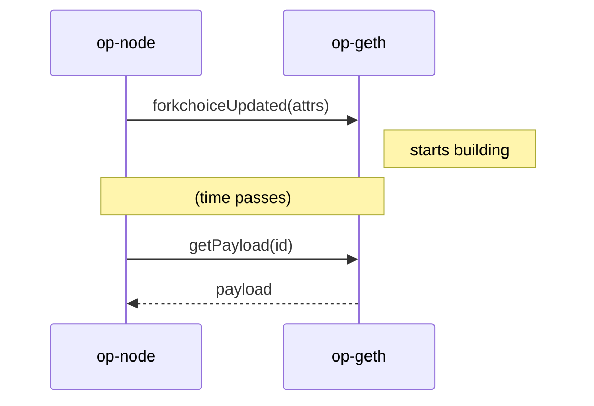

# Background

How op-node and op-geth coordinate block building. Essential context for understanding the sidecar designs.

## The Dance



**op-node** is the conductor. It decides when blocks start and end.
**op-geth** is the builder. It assembles transactions into blocks.

## FCU: "Start Building"

When op-node sends `forkchoiceUpdated` with `PayloadAttributes`:

1. op-geth creates a payload ID and returns immediately
2. A background goroutine starts building
3. Forced transactions (if any) are executed first
4. Mempool transactions fill the rest

**Key fields in PayloadAttributes:**
- `timestamp` — when this block should be timestamped
- `transactions[]` — forced transactions, executed first, in order
- `noTxPool` — if true, skip mempool entirely

## GetPayload: "Give Me the Block"

When op-node calls `getPayload`:

1. op-geth returns whatever it has built so far
2. The background goroutine stops
3. Done

## Timing

**Who controls block time?** op-node.

op-node sends FCU, waits ~1.95s (for 2s blocks), then calls getPayload. op-geth just builds until asked to stop.

**What about op-geth's internal timer?**

```go
blockTime := newTimestamp - parentTimestamp  // e.g., 2s
endTimer := time.NewTimer(blockTime)         // safety timeout
```

This is a fallback in case getPayload never comes. Normally, getPayload arrives first and stops the build.

**What about Recommit?**

```go
Recommit: 6 * time.Second  // default
```

This is how often op-geth would rebuild with fresh mempool txs. But with 2s blocks, getPayload comes before the first Recommit fires. So effectively: **one build, then done.**

## Forced Transactions

When `PayloadAttributes.transactions[]` is set:

```go
for _, tx := range genParam.txs {
    err = miner.commitTransaction(work, tx)
    if err != nil {
        return error  // block build FAILS, not silently skipped
    }
}
// then mempool txs (if noTxPool=false)
```

- Executed first, in order
- If any fails, the entire block build fails
- Never silently dropped

This is the guarantee we rely on for Gating Sidecar.

## Summary

| Question | Answer |
|----------|--------|
| Who starts blocks? | op-node (via FCU) |
| Who ends blocks? | op-node (via getPayload) |
| Who controls timing? | op-node |
| What does op-geth do? | Builds until told to stop |
| How are forced txs handled? | First, in order, fail-fast |
