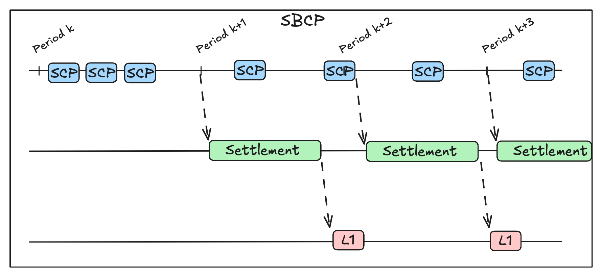
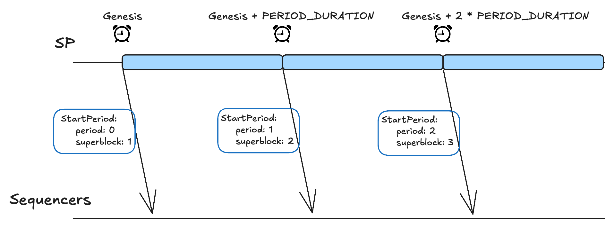
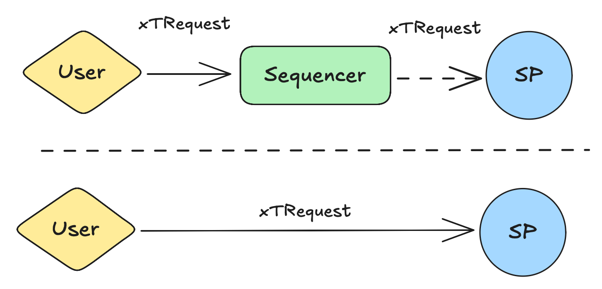
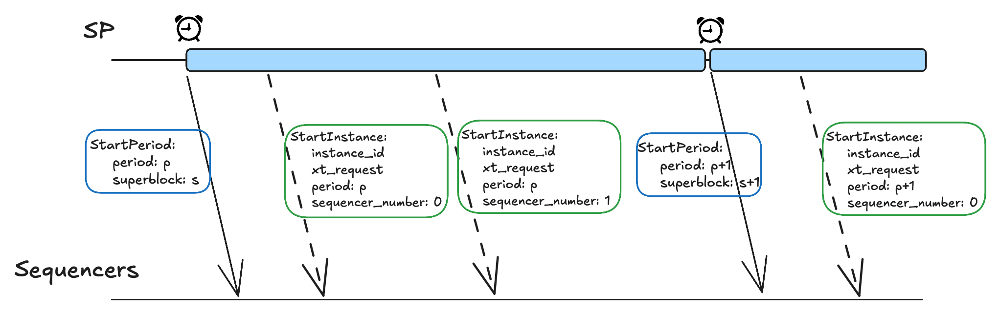
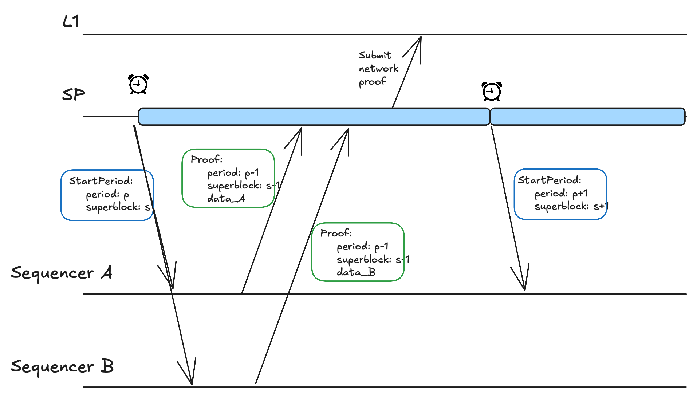
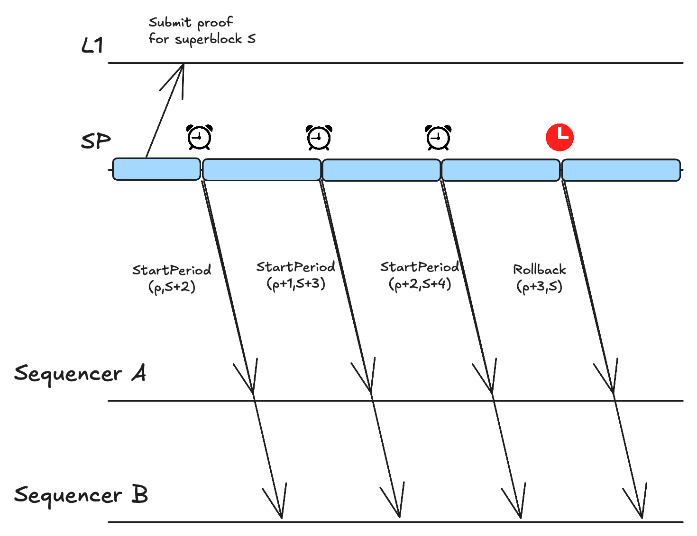
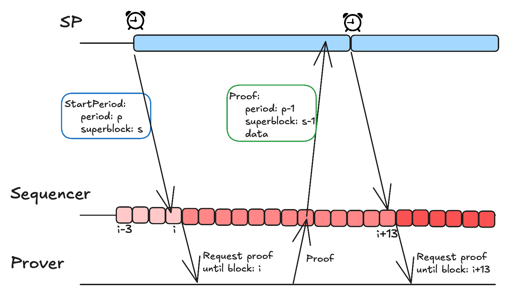

# Superblock Construction Protocol v2 (SBCP v2)

This document specifies SBCP v2, which has as objectives:
1. The orchestration of scheduling and execution of composability instances.
2. The progression of the L1 common settlement contract.

To achieve (1), the publisher will have a queue of requests and
will initialize them such that a rollup is never part of two different
instances at the same time.

To achieve (2), the publisher will organize time into *periods*,
such that, once a period ends, it will trigger the settlement pipeline
for proving the activity during the ended period.
Once the pipeline finishes successfully, the publisher will
publish the unique proof to L1, advancing the state.
In case the proof can't be generated within a reasonable time window,
the publisher will trigger a rollback.
Notice that, while the publisher orchestrates the settlement progression
and input, the L1 contract is responsible for the validity and security of
the state updates.

Note that the SCP and settlement protocols are used as building blocks for SBCP.



> [!TIP]
> If you prefer to first read an informal intuition explanation about the protocol,
> please read the [SBCP v2 Informal Intuition](#informal-intuition) section.

## Table of Contents

- [Comparison to V1](#comparison-to-v1)
- [System Model](#system-model)
- [Properties](#properties)
- [Time And Periods](#time-and-periods)
- [Protocol](#protocol)
  - [Messages](#messages)
  - [Shared Publisher](#shared-publisher-sp)
  - [Sequencer](#sequencer)
- [Informal Intuition](#informal-intuition)

## Comparison to V1

This version intends to solve issues with SBCP v1 in the following ways:
- Remove the SBCP v1 tight "slot" coupling (`StartSlot` and `RequestSeal` messages).
Now, rollups can have independent block times.
- Define a *superblock* concept aligned with settlement.
While settlement was producing a *superblock* every ~1 hour, according to its own rules,
SBCP v1 was using another concept of a *superblock*, which was produced every 12 seconds. 
- Allow parallel composability instances execution for disjoint sets of participating chains,
which was strictly sequential in SBCP v1.
- Align rollback logic to failure of the proof pipeline.
In contrast, V1 could roll back every 12 seconds, due to temporary bad network conditions. 
- Allow rollups to keep sovereignty over the DA layer instead of making the SP responsible for it.

## System Model

**Actors and roles**:
- **Shared Publisher (SP)**: the coordinator that schedules composability instance
and triggers period update and the settlement pipeline.
- **Native Sequencers**: one per rollup, who builds L2 blocks at a self-chosen frequency,
participates in composability when instructed, and produces proofs about its blocks and mailbox activity.

**Communication**:
- Authenticated, partially synchronous channels between any two actors.

**Fault model**:
- Crash faults for sequencers, while the SP must be live to guarantee termination. 
- Byzantine misbehavior is mitigated by ZK settlement checks (mailbox consistency, range/aggregation proofs)
and by protocol enforcement (e.g., mailbox contract),
though it's not covered here and should be treated in a later version.

## Properties

**Safety**
- **Agreement**: All correct processes that finalize a superblock number $N$ agree on the same superblock object for $N$, read from L1.
- **Monotonicity**: Finalized superblocks form a single chain, each referencing the previous via parent hash, with monotonically increasing superblock numbers.
- **Composability** Consistency: For every ended period, every pair of chains agree on the same **ordered** set of successful composability instances that both participated. 
- **Sequentiality**: For any rollup, composability instances are executed one at a time (no overlap).

**Liveness** (under partial synchrony and live SP)
- **Superblock Progress**: Eventually, every superblock produced during a period is finalized or discarded, and a rollback is triggered. 

## Time And Periods

| Config            | Value                                   |
|-------------------|-----------------------------------------|
| `PERIOD_DURATION` | $10\times 32 \times 12 = 3840$ seconds. |
| `GENESIS_TIME`    | Configurable by implementation.         |


SBCP v2 groups composability instances into long time periods, aligned with the usual settlement cadence.

The default period duration is 10 Ethereum epochs, i.e., 3840 seconds.

Periods are counted from a **genesis** time.
Thus, the period $k$ starts at:

```PeriodStart(k) = GenesisTime + k * PERIOD_DURATION```

Notes:
- Rollups may keep independent L2 block times; only period boundaries are common.
- Still, rollups are abstracted from the period time logic
since the SP will trigger them via a start message, as described below.

## Protocol

### Messages

```protobuf3
// Internal
message TransactionRequest {
  uint64 chain_id = 1;
  repeated bytes transaction = 2;
}

// User -> Sequencer and Sequencers/Users -> SP
message XTRequest {
  repeated TransactionRequest transaction_requests = 1;
}

// SP -> Sequencers
message StartInstance {
  bytes instance_id = 1;
  uint64 period_id = 2;
  uint64 sequence_number = 3;
  XTRequest xt_request = 4;
}

// SP -> Sequencers
message Decided {
  bytes instance_id = 1;
  bool decision = 2;
}

// SP -> Sequencers
message StartPeriod {
  uint64 period_id = 1;
  uint64 superblock_number = 2;
}

// SP -> Sequencers
message Rollback {
  uint64 period_id = 1;
  uint64 last_finalized_superblock_number = 2;
  bytes last_finalized_superblock_hash = 3;
}

// Sequencers -> SP
message Proof {
  uint64 period_id = 1;
  uint64 superblock_number = 2;
  bytes proof_data = 3;
}
```

> [!Note]
> While `StartInstance` and `Decided` messages are used in the SCP protocol,
> they also appear here as the SBCP's hook to start/finish SCP instances.


### Shared Publisher (SP)

The SP is the coordinator of the protocol, managing
the initiation of periods and composability instances,
and controlling rollbacks when necessary.

**Period Management**

The SP tracks the current period and
broadcasts an `StartPeriod` message whenever a new period starts.
The `StartPeriod` message carries the new period ID as well as
the superblock number that will be built in such a new period.



Note that in the above figure, the next superblock number to be built started from 1
as it's assumed that there is agenesis superblock 0.

Also, note that, even though in the figure the superblock is always the period number plus 1,
this relation doesn't necessarily hold. I.e., the period ID doesn't fully determine
the superblock number and so it isn't redundant.
This happens due to the possibility of rollbacks, which may
revert to a previous superblock number, even though
the period ID is always monotonically increasing.

**Composability Management**

Users' requests are represented by `XTRequest`.
They can either be directly sent to the SP
who will put it in the queue and schedule it,
or the user can send it to a sequencer, who will simply forward it to the SP.



During a period, the SP initiates multiple composability instances.
Each starting instance is tagged with the current period ID and
a sequence number, a monotonically increasing counter which
resets at the beginning of each period.
Furthermore, it includes a unique identifier for this instance,
`instance_id`, which is computed as $H(period\_id || sequence\_number || XTRequest)$,
where $H$ is the SHA-256 cryptographic hash function.
Note that, in case a request fails and the user retries it
with the exact same data (accounts' nonces, etc.),
the `instance_id` will change as it depends on both
the period ID and the sequence number.



Such as local transactions are processed sequentially by the EVM,
cross-chain transactions also should be isolated from other transactions.
During an instance,
neither local transactions can be processed (as described next in the
sequencer section) nor other composability instances can be started.
Thus, the SP must ensure that no two instances overlap in terms of participating chains.
For that, it holds the set of active chains (i.e., those currently participating in an instance)
and updates it according to instance starts and terminations.

```pseudocode
can_start_instance(active_chains, xt_request):
    req_chains = xt_request.get_chains()
    if any chain in req_chains is in active_chains:
        return False
    else:
        return True
```

The protocol is flexible regarding queue management of pending
requests and whatever priority policy is desired.
Still, whenever implementation wants to start a new instance,
the spec restricts whether it can be started or not,
according to the function above.

**Settlement Management**

Once a period finishes, the SP starts the settlement pipeline for
the superblock associated with it,
along with a timer with `ProofWindow` duration.

According to the settlement protocol, each rollup will produce a proof and
send it to the SP via the `Proof` message.
Once the SP collects all proofs, it produces the network proof and
publishes it to L1. Once the associated L1 event is received,
the SP updates its settled state.



In case the timer expires, and it hasn't yet produced the network proof,
or in case the settlement pipeline fails (e.g., due to invalid proofs),
the SP will broadcast a `Rollback` message
with the current period ID and
the last finalized superblock number and hash,
resetting the network to it.



Note that, in the above scenario, the period ID keeps increasing,
though the network rolls back to a previous superblock number $S$
and builds $S+1$ again in the next period.

### Sequencer

**Period and Settlement Management**

The sequencer receives the `StartPeriod` message from the SP and keeps track
locally of the current period ID and the next superblock number to be built.
Once a new period starts, it should start the settlement pipeline for the previous period
as soon as the last block that belongs to it is closed.



Note that the settlement isn't started as soon
as the `StartPeriod` message is received,
but rather once the last block that
was created during the previous period is closed.

Once a proof is generated, the sequencer sends it to the SP
via the `Proof` message.

The sequencer also keeps track of the last finalized superblock
by listening to L1 events.
In case the SP starts a rollback, via the `Rollback` message,
the sequencer reverts its local state,
setting the head to its last finalized block
(included in the last finalized superblock),
and updates the period ID and next superblock number according
to the message's content.

**Block Building & Instance Policy**

The sequencer builds L2 blocks at its own frequency.
Whenever a block is created, it adds a tag for it with
the current period ID and superblock number,
so that it's included in the settlement of such a superblock.
This tag never changes throughout the block's life.

Note, however, that in the case of rollbacks, these unfinalized blocks
are dropped along with their tags, and new blocks (with already seen
block numbers and pre-state roots) may be re-created
with new tags.

Whenever a sequencer receives a `StartInstance` message,
it should start the instance and stop processing local transactions
to preserve EVM isolation.
It only re-enables local transaction processing once
the current instance ends, by a `Decided` message or due to a `Vote(0)`.

There are edge conditions by which the sequencer may reject
the instance, immediately aborting it via a `Vote(0)`
message. These include:
1. If it receives the message for an older period or sequence number.
2. If the period ID is higher than the current block's period ID (edge case in
which the period advanced, but the last block for the previous period
is still being built).
3. If it already has an active instance.

In case the SP is honest, the third scenario should only happen
due to network delays (e.g., a `Decided` message gets delayed
and the next `StartInstance` arrives before it).
To mitigate such issues, implementation can
include standard message delivery management techniques,
which smartly buffer messages and deliver them to the
app in the appropriate order.


## Informal Intuition

Our building blocks are:
- SCP: provides a way for sequencers to agree on including or not a request.
- Settlement: allows constructing a valid ZKP to be posted to L1,
given that the chains produced valid L2 blocks and agree on the mailbox state.

Agreeing on the mailbox state means that all rollups started the settlement
with the same set of decided composability instances, in the same order.

**Example**: Suppose all cross-chain requests involve chains A and B.
If chain A executed the requests $(r_1, r_2, r_3)$, then,
in order for the mailbox states to be consistent, chain B
must also have executed the requests $(r_1, r_2, r_3)$ in the same order.
If B started the settlement pipeline with its state updated only by $(r_1, r_2)$
(or in a different order like $(r_2, r_1, r_3)$),
then the consistency check would fail.

That's the goal of the SBCP: to make sure sequencers start the settlement pipeline
at common states.

Besides this, because rollups can't participate in more than one composability instance
at a time (due to EVM sequentiality and instance isolation), SBCP must also enforce such isolation.
This logic should exist in the SP who starts and manages the instances.
