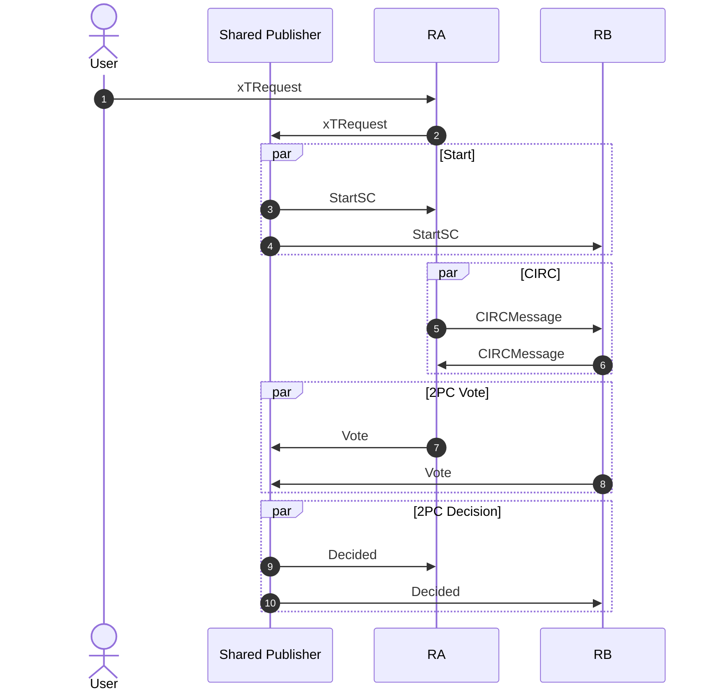

# Synchronous Composability Protocol (SCP) <!-- omit from toc -->

This document explains the Synchronous Composability Protocol that allows a set of sequencers, along with a shared publisher, to decide on the inclusion of a cross-chain transaction.

## Table of Contents <!-- omit from toc -->
- [System Model](#system-model)
- [Properties](#properties)
- [Messages](#messages)
- [Protocol](#protocol)
- [Fault Tolerance](#fault-tolerance)
- [Example Sequence Diagram](#example-sequence-diagram)
- [Complexity](#complexity)
- [References](#references)


## System Model

The system consists of the following primary components/actors:
- **Users**: Clients who submit cross-chain transaction requests containing a batch of transactions targeting multiple rollups.
- **Rollups**: L2 chains following the OP Stack, each with its own Mailbox contract.
- **Sequencers**: One sequencer per rollup responsible for transaction inclusion and sequencing.
- **Shared Publisher (SP)**: A fixed actor that coordinates the protocol.

The communication is assumed to be authenticated and asynchronous. It can be implemented via Protobuf-encoded messages over network endpoints provided by some external layer.

The system tolerates crash fault from sequencers, though the shared publisher can't crash to guarantee termination.
This is explored more deeply in the [Fault Tolerance](#fault-tolerance) section.

## Properties

The protocol keeps the properties of 2PC, ensuring the following safety properties:
- **Validity**: (i) If any process votes 0, then 0 is the only possible decision value. (ii) If all process vote 1 and there are no failures, then 1 is the only possible decision value.
- **Agreement**: If two correct processes decide $b$ and $b'$, then $b = b'$.

And liveness property:
- **Termination**: If there are no failures, then all processes eventually decide (*weak termination*).

Extended desired properties for block sequencing will be provided in the [superblock construction protocol document](./superblock_construction_protocol.md).

## Messages

```protobuf
// User request
message xTRequest {
    repeated TransactionRequest Transactions = 1;
}
message TransactionRequest {
    uint32 ChainID = 1;
    repeated bytes Transaction = 2;
}
// Start
message StartSC {
    uint64 Slot = 1;
    uint64 xTSequenceNumber = 2;
    xTRequest xTRequest = 3;
    bytes xTid = 4; // 32-byte SHA256 hash over xTRequest
}
// CIRC
message CIRCMessage {
    uint32 SourceChainID = 1;
    uint32 DestinationChainID = 2;
    repeated bytes Source = 3;
    repeated bytes Receiver = 4;
    uint32 SessionID = 5;
    string Label = 6;
    repeated bytes Data = 7; // ABI encoded arguments
    bytes xTid = 8;
    uint64 Slot = 9;
}
// 2PC
message Vote {
    bytes SenderChain = 1;
    bytes xTid = 2;
    bool Vote = 3;
    uint64 Slot = 4;
}
message Decided {
    bytes xTid = 1;
    bool Decision = 2;
    uint64 Slot = 3;
}
```

where `TransactionRequest.Transaction` is an encoded [Ethereum transaction](https://github.com/ethereum/go-ethereum/blob/master/core/types/transaction.go).

Where present, the slot and xT sequence number serves only for identification for the upper protocol layer.
Thus, it can be ignored for the discussion presented here.

## Protocol

Before the protocol even starts, sequencers receive cross-chain transaction requests from users and send them to the shared publisher, who is responsible for starting the protocol to decide on their inclusion.
The shared publisher starts the protocol by sending a `StartSC` message, which contains the slot number they are in, the cross-chain request, its identifier, and the ordering number in the slot for such request.
In parallel to sending the message, the shared publisher starts a local timer.

Once a sequencer receives the `StartSC` message, it starts its local timer and filters transactions that target its chain according to the `ChainID` field.
Then, it simulates its transactions by executing them alongside a tracer that keeps track of Mailbox write and read calls.
The simulation returns an execution result and a collection of CIRC messages produced.
Every created CIRC message should be sent to the sequencer of the message's destination chain through a `CIRCMessage`, if not sent already.
If the execution result is an error due to a missing message in a Mailbox read operation, the sequencer waits for such a message.
Whenever a new CIRC message is received, the sequencer adds a transaction that populates the mailbox with the received message and tries the whole process again.
The sequencer only terminates this phase on 2 conditions:
1. Once the simulation returns a successful or failure execution result, with the failure not caused by the Mailbox.
2. Local timer expires.

Once the sequencer terminates the simulation phase and knows the transaction's execution result, it sends a `Vote` message to the shared publisher with a flag indicating whether it can include the transaction or not.
The shared publisher waits for a vote from every participating rollup.
If all votes are received with `vote=True`, then it broadcasts a `Decided` message with `decision=True`.
If a vote is received with `vote=False`, it can immediately terminate (even it didn't receive all votes yet) and broadcast a `Decided` message with `decision=False`.

Upon receiving a `Decided` message, the sequencer stores the output and, if `decision=True`, adds its transactions to the block, or, if `decision=False`, doesn't add the transaction to the block and removes the transactions created to populate the Mailbox.

On the side of the sequencer, if there's a timeout and it hasn't sent a `Vote` message yet, it sends a `Vote` message with `vote=False`.
On the side of the shared publisher, if there's a timeout and it didn't send a `Decided` message yet, it sends a `Decided` message with `decision=False`.

It's important to note that, in any case, the sequencer can only send one `Vote` message and the shared publisher one `Decided` message. Therefore, whenever processing a trigger such as the timeout, the receipt of all votes, or the receipt of a missing CIRC message, the process must check that the outcome message wasn't sent before.

> [!NOTE]
> The location of this transaction that populates the Mailbox doesn't need to be strictly top-of-block.
> The only requirement is that it happens before the transaction of the cross-chain request.


`ScpSequencerInstance` - **SCP Algorithm for the sequencer for a cross-chain transaction with ID xTid**
```
Constants:
    ownChainID              // ID of the rollup this sequencer is responsible for
    xTid                    // Cross-chain transaction ID
    timerDuration

State Variables:
    hasVoted ← False        // Flag for whether a Vote was sent
    decision ← ⊥            // Final decision received
    timer                   // Local timer
    localTxs                // Transactions to be simulated for this chain

Upon receiving StartSC(_, _, xTRequest, xTid):
    set timer to running and expire after timerDuration seconds
    localTxs ← filter xTRequest.Transactions where ChainID = ownChainID
    SimulateLocalTxs()

Procedure SimulateLocalTxs():
    (result, circMsgs) ← Simulate(localTxs)

    for msg in circMsgs:
        if msg not yet sent:
        send msg to destination sequencer

    if result == failure_due_to_mailbox_read:
        return
    else if result == transaction_success:
        Vote(True)
    else if result == transaction_failure:
        Vote(False)

Upon receiving a new CIRCMessage(...) for xTid:
    populateInbox(CIRCMessage(...)) // Adds a transaction that populates the mailbox with the CIRC message
    SimulateLocalTxs()

Procedure Vote(v):
  if hasVoted == False:
    hasVoted ← True
    send Vote(ownChainID, xTid, v) to the shared publisher

Upon timer expires and hasVoted == False:
  Vote(False)

Upon receiving Decided(xTid, decisionFlag):
    decision ← decisionFlag
    if decisionFlag == True:
        add localTxs to block
    else:
        don't add localTxs to block and remove the added txs that populated the Mailbox
```


`ScpPublisherInstance` - **SCP Algorithm for the shared publisher for a cross-chain transaction with ID xTid**
```
Constants:
    xTid                    // Cross-chain transaction ID
    timerDuration

State Variables:
    hasDecided ← False      // Flag for whether a Decided message was sent
    timer                   // Local timer
    rollups ← ⊥             // Set of participating rollups
    votes ← ∅               // Set of participating rollups

Procedure Start(xTRequest, xTid, slot, seqNumber, participatingRollups):
    set timer to running and expire after timerDuration seconds
    rollups ← participatingRollups
    send StartSC(slot, seqNumber, xTRequest, xTid) to all sequencers of the participating rollups

Upon receiving a new Vote(chain, xTid, vote):
    if vote == False:
        Decide(False)
    else:
        votes.add(chain)

        if len(votes) == len(rollups):
            Decide(True)

Procedure Decide(v):
    if hasDecided == False:
        hasDecided ← True
        send Decided(xTid, v) to all sequencers of the participating rollups

Upon timer expires and hasDecided == False:
    Decide(False)
```

The timer duration should be a configurable value with a default value of 3 seconds.

It's important to notice that the protocol doesn't define when a shared publisher should start a protocol instance for a certain cross-chain transaction request. This is abstracted with the `Start` procedure and should be specified in the [superblock construction protocol](./superblock_construction_protocol.md).


## Fault Tolerance

Following the 2PC system model, the system tolerates crash fault from sequencers.
However, to guarantee the termination property, the shared publisher can't crash.

Even though it's expected that it doesn't tolerate Byzantine behavior, possible malicious actions should be analyzed and mitigated through protocol rules or slashing mechanisms.

Immediate possible byzantine actions from the shared publisher include:
1. Sending a `Decided` message that conflicts with votes.
2. Sending an early `Decided` message with `decided=False`.

Action (1) can be prevented with message authentication and appending a justification to the decided message.
Action (2) can't be prevented, but mitigated with shared publisher rotation.

Immediate possible byzantine actions from the sequencer include:
1. Tampering the user's request.
2. Sending a tampered CIRC message.
3. Sending a `Vote` message with `vote=False` when the transaction is valid.
4. Sending a `Vote` message with `vote=True` when the transaction is invalid.

Action (1) can be prevented with message authentication.
Action (2) can be prevented with the ZK proof for the block and with the `A.Mailbox[from B] = B.Mailbox[to A]` checks for all pairs of chains. Note that `to A` is produced by the VM, and `from B` was sent by the sequencer. Thus, the sequencer is enforced to match the VM-produced message.
Action (3) can't be prevented, but mitigated with sequencer rotation.
Action (4) can be prevented by ensuring that the sequencer includes the transaction in the final block (given the agreed on cross-chain transaction IDs) and with a ZK proof for the block.

## Example Sequence Diagram




## Complexity

- **Time complexity** is $D + 3 = O(D)$, where $D$ is maximum dependency degree between CIRC messages. Note that it's **not** the number of *CIRCMessages*. For example, if there are 10 messages but none depend on the other, then $D = 1$.
- **Message complexity** is $S + M + S + S = O(S + M)$, where $S$ is the number of participating rollups and $M$ is the number of *CIRCMessages*.
- **Communication complexity** is $O(S\cdot T + M\cdot C)$ where $T$ is the size of the transaction request and $C$ the size of CIRC messages.

## References

- [Nany Lynch - Distributed Algorithms (1997) (2PC: section 7.3.2)](https://books.google.pt/books/about/Distributed_Algorithms.html?id=2wsrLg-xBGgC&source=kp_book_description&redir_esc=y)