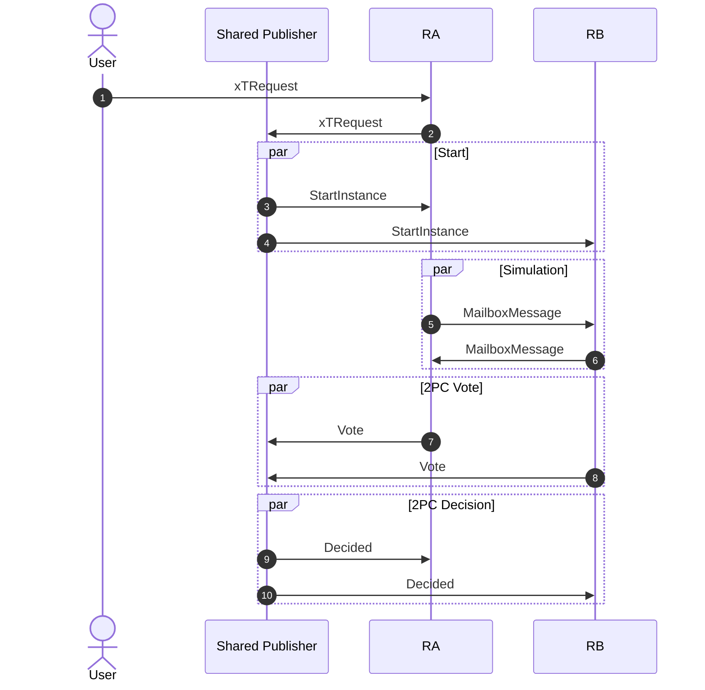

# Synchronous Composability Protocol (SCP) <!-- omit from toc -->

This document explains the Synchronous Composability Protocol that allows a set of sequencers, along with a shared publisher, to decide on the inclusion of a cross-chain transaction.

## Table of Contents <!-- omit from toc -->
- [System Model](#system-model)
- [Properties](#properties)
- [Messages](#messages)
- [Protocol](#protocol)
- [Fault Tolerance](#fault-tolerance)
- [Example Sequence Diagram](#example-sequence-diagram)
- [Complexity](#complexity)
- [References](#references)


## System Model

The system consists of the following primary components/actors:
- **Users**: Clients who submit cross-chain transaction requests containing a batch of transactions targeting multiple rollups.
- **Sequencers**: One sequencer per rollup responsible for transaction inclusion and sequencing.
- **Shared Publisher (SP)**: A fixed actor that coordinates the protocol.


Communication:
- Authenticated, partially synchronous channels between any two actors.

Fault model (explored more deeply in the [Fault Tolerance](#fault-tolerance) section):
- Crash faults for sequencers, while the SP must be live to guarantee termination.

## Properties

The protocol keeps the properties of 2PC, ensuring the following safety properties:
- **Validity**: (i) If any process votes 0, then 0 is the only possible decision value. (ii) If all processes vote 1 and there are no failures, then 1 is the only possible decision value.
- **Agreement**: If two correct processes decide $b$ and $b'$, then $b = b'$.

And liveness property:
- **Termination**: If there are no failures, then all processes eventually decide (*weak termination*).

Extended desired properties for block sequencing will be provided by the SBCP protocol.

## Messages

```protobuf
// Internal
message TransactionRequest {
  uint64 chain_id = 1;
  repeated bytes transaction = 2;
}

// User -> Sequencer and User/Sequencer -> SP
message XTRequest {
  repeated TransactionRequest transaction_requests = 1;
}

// SP -> Sequencers
message StartInstance {
  bytes instance_id = 1;
  uint64 period_id = 2;
  uint64 sequence_number = 3;
  XTRequest xt_request = 4;
}

// Sequencers -> SP
message Vote {
  bytes instance_id = 1;
  uint64 chain_id = 2;
  bool vote = 3;
}

// SP -> Sequencers
message Decided {
  bytes instance_id = 1;
  bool decision = 2;
}

// Sequencer -> Sequencer
message MailboxMessage {
  bytes instance_id = 1;
  uint64 source_chain = 2;
  uint64 destination_chain = 3;
  bytes source = 4;
  bytes receiver = 5;
  uint64 session_id = 6;
  string label = 7;
  repeated bytes data = 8;
}
```

where `TransactionRequest.Transaction` is an encoded [Ethereum transaction](https://github.com/ethereum/go-ethereum/blob/master/core/types/transaction.go).

Where present, instance ID, period ID, and sequence numbers serve only for identification for the upper protocol layer (SBCP).
Thus, it can be ignored for the discussion presented here.

## Protocol

Before the protocol even starts, sequencers receive cross-chain transaction requests from users and send them to the shared publisher, who is responsible for starting the protocol to decide on their inclusion.
The shared publisher starts the protocol by sending a `StartInstance` message, which contains identifiers and the user's request.
In parallel to sending the message, the shared publisher starts a local timer.

Once a sequencer receives the `StartInstance` message, it starts its local timer and filters transactions that target its chain according to the `ChainID` field.
Then, it simulates its transactions by executing them alongside a tracer that keeps track of Mailbox write and read calls.
The simulation returns an execution result, and a collection of produced Mailbox messages.
Every created Mailbox message should be sent to the sequencer of the message's destination chain through a `MailboxMessage`, if not sent already.
If the execution result is an error due to a missing message in a Mailbox read operation, the sequencer waits for such a message.
Whenever a new Mailbox message is received and expected by the transactions, the sequencer adds an auxiliary transaction (`mailbox.putInbox`) that populates the mailbox with the received message and tries the whole process again.
The sequencer only terminates this phase on 2 conditions:
1. Once the simulation returns a successful or failure execution result, with the failure not caused by the Mailbox.
2. Local timer expires.

Once the sequencer terminates the simulation phase and knows the transaction's execution result, it sends a `Vote` message to the shared publisher with a flag indicating whether it can include the transaction or not.
The shared publisher waits for a vote from every participating rollup.
If all votes are received with `vote=True`, then it broadcasts a `Decided` message with `decision=True`.
If a vote is received with `vote=False`, it can immediately terminate (even it didn't receive all votes yet) and broadcast a `Decided` message with `decision=False`.

Upon receiving a `Decided` message, the sequencer stores the output and,
if `decision=True`, adds the list of auxiliary and main transactions to the block,
otherwise (`decision=False`), it doesn't add any transaction to the block, reverting to the original state prior to the protocol.

On the side of the sequencer, if there's a timeout, and it hasn't sent a `Vote` message yet, it sends a `Vote` message with `vote=False`.
On the side of the shared publisher, if there's a timeout, and it didn't send a `Decided` message yet, it sends a `Decided` message with `decision=False`.

It's important to note that, in any case, the sequencer can only send one `Vote` message and the shared publisher one `Decided` message.
Therefore, whenever processing a trigger such as the timeout, the receipt of all votes, or the receipt of a missing Mailbox message, the process must check that the outcome message wasn't sent before.

> [!NOTE]
> The location of this transaction that populates the Mailbox doesn't need to be strictly top-of-block.
> The only requirement is that it happens before the transaction of the cross-chain request.


`ScpSequencerInstance` - **SCP Algorithm for the sequencer**
```
Constants:
    ownChainID              // ID of the rollup this sequencer is responsible for
    id                    // Cross-chain transaction ID
    timerDuration

State Variables:
    hasVoted ← False        // Flag for whether a Vote was sent
    decision ← ⊥            // Final decision received
    timer                   // Local timer
    localTxs                // Transactions to be simulated for this chain
    putInboxTxs ← ∅         // mailbox.putInbox transactions to populate the mailbox for read operations
    expectedMailbox ← ∅     // messages that are still expected to be received from other sequencers
    receivedMailbox ← ∅     // messages received from other sequencers, but not yet processed

Upon receiving StartInstance(id, _, _, xTRequest):
    set timer to running and expire after timerDuration seconds
    localTxs ← filter xTRequest.Transactions where ChainID = ownChainID
    SimulateLocalTxs()

Procedure SimulateLocalTxs():
    (result, writtenMsgs) ← Simulate(putInboxTxs, localTxs)

    for msg in writtenMsgs:
        if msg not yet sent:
            send msg to destination sequencer

    if result == failure_due_to_mailbox_read:
        expectedMailbox ← add missing message from result
        return consumeMessagesAndRetry()
    else if result == transaction_success:
        Vote(True)
    else if result == transaction_failure:
        Vote(False)

procedure consumeMessagesAndRetry():
    msgs = expectedMailbox ∩ receivedMailbox
    if msgs != ∅:
        expectedMailbox.remove(msgs)
        receivedMailbox.remove(msgs)
        putInboxTxs.add(mailbox.putInbox(msgs))
        return SimulateLocalTxs()

Upon receiving a new MailboxMessage(...):
    receivedMailbox.add(MailboxMessage(...))
    consumeMessagesAndRetry()

Procedure Vote(v):
  if hasVoted == False:
    hasVoted ← True
    send Vote(id, ownChainID, v) to the shared publisher

Upon timer expires and hasVoted == False:
  Vote(False)

Upon receiving Decided(id, decisionFlag):
    decision ← decisionFlag
    if decisionFlag == True:
        add localTxs to block
    else:
        don't add localTxs to block and remove the added txs that populated the Mailbox
```


`ScpPublisherInstance` - **SCP Algorithm for the shared publisher**
```
Constants:
    id                    // instance ID
    timerDuration

State Variables:
    hasDecided ← False      // Flag for whether a Decided message was sent
    timer                   // Local timer
    rollups ← ⊥             // Set of participating rollups
    votes ← ∅               // Set of participating rollups

Procedure Start(id, periodID, seqNumber, xTRequest):
    set timer to running and expire after timerDuration seconds
    rollups ← chains from xTRequest
    send StartInstance(id, periodID, seqNumber, xTRequest,) to all sequencers in [rollups]

Upon receiving a new Vote(id, chain, vote):
    if vote == False:
        Decide(False)
    else:
        votes.add(chain)

        if len(votes) == len(rollups):
            Decide(True)

Procedure Decide(v):
    if hasDecided == False:
        hasDecided ← True
        send Decided(id, v) to all sequencers in [rollups]

Upon timer expires and hasDecided == False:
    Decide(False)
```

The timer duration should be a configurable value with a default of 1 second.

It's important to notice that the protocol does not define when
the SP should start a protocol instance for a certain request.
This is abstracted with the `Start` procedure and is specified
in SBCP.


## Fault Tolerance

Following the 2PC system model, the system tolerates crash fault from sequencers.
However, to guarantee the termination property, the shared publisher can't crash.

Even though it's expected that it doesn't tolerate Byzantine behavior, possible malicious actions should be analyzed and mitigated through protocol rules or slashing mechanisms.

Immediate possible byzantine actions from the shared publisher include:
1. Sending a `Decided` message that conflicts with votes.
2. Sending an early `Decided` message with `decided=False`.

Action (1) can be prevented with message authentication and appending a justification to the decided message.
Action (2) can't be prevented, but mitigated with shared publisher rotation.

Immediate possible byzantine actions from the sequencer include:
1. Tampering the user's request.
2. Sending a tampered Mailbox message.
3. Sending a `Vote` message with `vote=False` when the transaction is valid.
4. Sending a `Vote` message with `vote=True` when the transaction is invalid.

Action (1) can be prevented with message authentication.
Action (2) can be prevented with the ZK proof for the block and with the `A.Mailbox[from B] = B.Mailbox[to A]` checks for all pairs of chains. Note that `to A` is produced by the VM, and `from B` was sent by the sequencer. Thus, the sequencer is enforced to match the VM-produced message.
Action (3) can't be prevented, but mitigated with sequencer rotation.
Action (4) can be prevented by ensuring that the sequencer includes the transaction in the final block (given the agreed on cross-chain transaction IDs) and with a ZK proof for the block.

## Example Sequence Diagram




## Complexity

- **Time complexity** is $D + 3 = O(D)$, where $D$ is maximum dependency degree between Mailbox messages. Note that it's **not** the number of *MailboxMessages*. For example, if there are 10 messages but none depend on the other, then $D = 1$.
- **Message complexity** is $S + M + S + S = O(S + M)$, where $S$ is the number of participating rollups and $M$ is the number of *MailboxMessages*.
- **Communication complexity** is $O(S\cdot T + M\cdot C)$ where $T$ is the size of the transaction request and $C$ the size of Mailbox messages.

## References

- [Nany Lynch - Distributed Algorithms (1997) (2PC: section 7.3.2)](https://books.google.pt/books/about/Distributed_Algorithms.html?id=2wsrLg-xBGgC&source=kp_book_description&redir_esc=y)