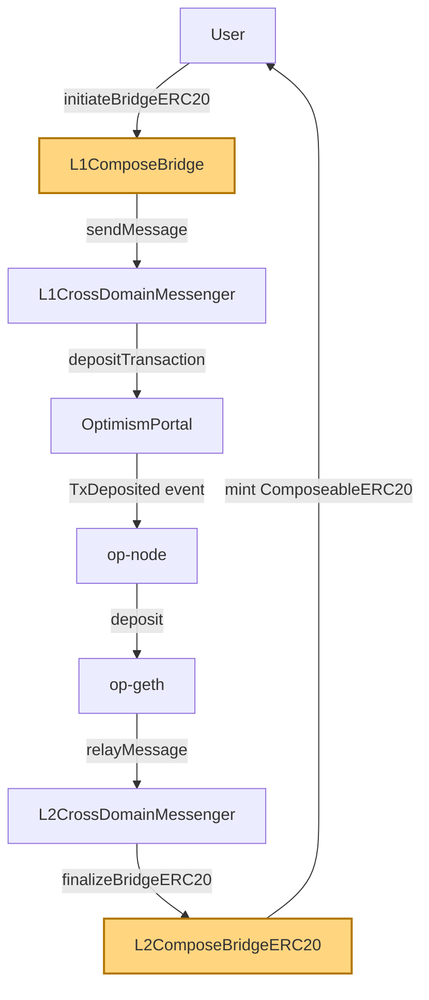
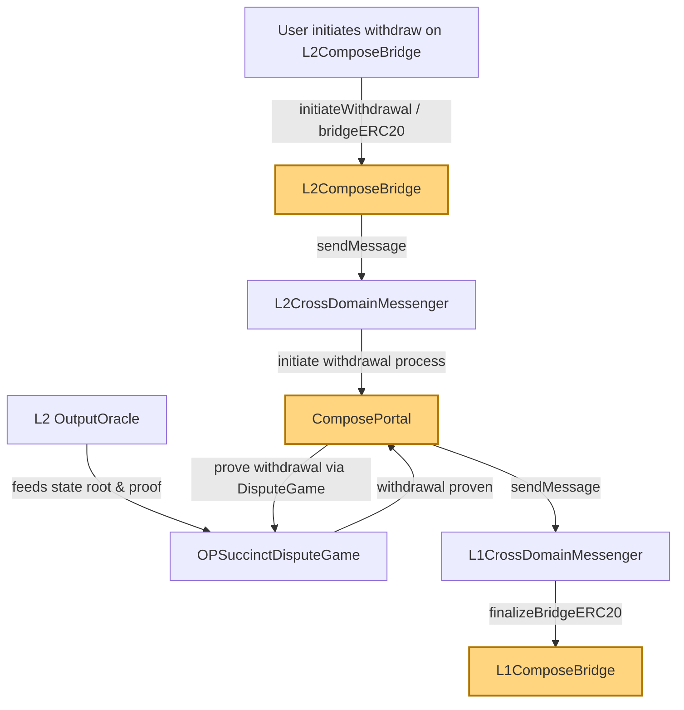

# Universal Shared Bridge for OP Chains  

The Universal Shared Bridge for OP Chains enables seamless asset transfers between Ethereum (L1) and any supporting OP L2, as well as directly between OP L2s. It leverages canonical custody on any chain, minting of "ComposeableERC20" (CET) tokens to represent bridged assets on L2s, and supports secure burn/mint logic for moving assets between L2s. All mint/burn operations are exclusively handled by the bridge contracts, ensuring safety. The bridge employs OP-Succinct proof mechanisms for L1 verifications and introduces efficient message-based transfers for L2↔L2 bridging, with formal post-transfer settlement. 

##  Objectives & Authoritative Requirements

1. **L1 Custody:** Ethereum (L1) is the main escrow (but not the only one) for **canonical ERC-20s and ETH**.  
2. **L1→L2 Representation:** Depositing an L1 ERC-20 to any OP L2 mints a **ComposeableERC20 (CET)** on that L2.  
3. **L2↔L2 Bridging:** The bridge supports moving both **native ERC-20** and **CET** between OP L2s. 
4. **L2↔L2 (ERC-20):** If the source asset is a **native ERC-20** on L2, it is **Locked** on the source L2 and a **CET is Minted** on the destination L2.  
5. **L2↔L2 (CET):** If the source asset is a **CET**, it is **Burned** on the source L2 and **Minted** on the destination L2.  
6. **L2→L1 Redemption:** Any CET can always be redeemed to **unlock the collateral on L1**.  
7. **Proof System:** The design **builds on OP-Succinct** (validity proofs). L1 verifications rely on **per-L2 finalized post roots**
8. **Mint Authority / Safety:** Only **bridge contracts** may mint or burn **CET**; no external mint paths.  
9. **Exit Logic (proof-based paths):** Use the **same exit logic as OP-Succinct**: prove claims against a chain’s **post root**, then an **MPT/storage proof** to the chain’s **Outbox/Exit root**, then a **Merkle inclusion** for the exit record.  
10. **Replay Protection:** Messages can be consumed only once. Any replay will be ignored.  
11. **Inter-L2 Fast Path:** For **L2↔L2** transfers, the destination **mints on receipt of a bridge message** (no proof verification at claim time). **Later settlement** is done simultaneously via aggregated proofs (out of scope here).
12. **TODO:** Allow token owner to have the bridge mint native token on specified conditions.


___

# L2↔L2 Bridge --- Sessioned Mailbox Flow


### Entities & Contracts

-  **ComposableERC20**
    An ERC20 wrapper native to the bridge.

-   **Bridge (per L2)**
    Handles: locking native ERC-20, burning CET, mailbox write/read, and
    minting (via token's `onlyBridge` gate when called from the bridge
    context).

    It should be deployed with CREATE2 so it has the same address on all chains.

-   **Mailbox (per L2)**
    Minimal append-only message bus with read-once semantics per
    `(chainSrc, recipient, sessionId, label)`.

    -   `write(chainId, account, sessionId, label, payload)`\
    -   `read(chainId, account, sessionId, label) → bytes`
        (consumes/marks delivered)

-   **Supported Token types**

    -   **Native ERC-20** on an L2 (not minted by bridge).
    -   **CET** (ComposeableERC20Token) --- canonical L2 representation
        of L1/L2 asset.
        -   `mint`/`burn` are **restricted** to `msg.sender == Bridge`.

-   **Deterministic CET Addresses (Superchain-style)**
    Each CET contract is deployed **at the same address across all OP
    L2s**, deterministically derived from the L1 canonical asset address using CREATE2.

    -   This eliminates the need for a per-chain registry.
    -   Mailbox payloads only need to carry the **`remoteToken` address**.
    -   On the destination chain, the bridge deterministically computes
        the CET address and mints to the receiver.

    **TODO** More details?

------------------------------------------------------------------------

##  ComposeableERC20

Inspired by `OptimismSuperChainERC20`, this is an ERC7802 compliant token for cross-chain transfers.
The code snippet below describe the main functionality.

```solidity
abstract contract ComposeableERC20 is ERC20, IERC7802 {
    /// @param _to     Address to mint tokens to.
    /// @param _amount Amount of tokens to mint.
    function crosschainMint(address _to, uint256 _amount) external {
        if (msg.sender != COMPOSE_TOKEN_BRIDGE) revert Unauthorized();

        _mint(_to, _amount);

        emit CrosschainMint(_to, _amount, msg.sender);
    }

    /// @param _from   Address to burn tokens from.
    /// @param _amount Amount of tokens to burn.
    function crosschainBurn(address _from, uint256 _amount) external {
        if (msg.sender != COMPOSE_TOKEN_BRIDGE) revert Unauthorized();

        _burn(_from, _amount);

        emit CrosschainBurn(_from, _amount, msg.sender);
    }
    
       /// @notice Storage struct for the BridgedComposeTokenERC20 metadata.
    struct BridgedComposeTokenERC20Metadata {
        /// @notice The ChainID where this token was originally minted.
        uint256 remoteChainID
        /// @notice Address of the corresponding version of this token on the remote chain.
        address remoteAsset;
        /// @notice Name of the token
        string name;
        /// @notice Symbol of the token
        string symbol;
        /// @notice Decimals of the token
        uint8 decimals;
    }
```

### Minting CET on the fly

The bridge can mint CETs on demand via a factory

```solidity
interface ICETFactory {
    function predictAddress(address l1Asset) external view returns (address predicted);
    function deployIfAbsent(
        address l1Asset,
        uint8 decimals,
        string calldata name,
        string calldata symbol,
        address bridge
    ) external returns (address deployed);
    // Salt derivation for deterministic addresses  
    function computeSalt(address l1Asset) external pure returns (bytes32);
}

ICETFactory public cetFactory;

function computeCETAddress(address remoteAsset) internal view returns (address) {
    return cetFactory.predictAddress(remoteAsset);
}

function ensureCETAndMint(
    address remoteAsset,
    string calldata name,
    string calldata symbol,
    uint8 decimals,
    address to,
    uint256 amount
) internal returns (address cet) {
    // 1) Predict deterministic address
    address predicted = computeCETAddress(remoteAsset);

    // 2) Deploy if missing (CREATE3-based factory)
    cet = cetFactory.deployIfAbsent(remoteAsset, decimals, name, symbol, address(this));
    require(cet == predicted, "CET address mismatch");

    // 3) Mint via bridge-only path
    IToken(cet).mint(to, amount);
    return cet;
}
```

-------------

###  Mailbox

Mailbox is a container of `Messages` divided into 2 boxes: 
- `Inbox` that has messages consumed by `Read()` function
- `Outbox` that has messages pushed into by `Write()` function.


``` solidity
  struct Message {
    MessageHeader header,
    bytes payload
  }

// Header for message. Its hash can serve as the message Identifier.
    struct MessageHeader {
        uint256 sessionId; // 16 bytes of version + 240 bytes of value chosen by the user
        uint256 chainSrc;  // chain ID where the message was sourced from
        uint256 chainDest; // chain ID of target destination
        address sender;    // The address on `chainSrc` initiating the message 
        address receiver;  // The address on `chainDest` receiving the message
        string label;      // Helps decipher the payload.
    }    

interface IMailbox {
    // `sender` writes to the OUTBOX a message to be relayed to `reciever` on `chainDest`
    function write(
        Message calldata message
    ) external;

    // `receiver` reads from the INBOX a message relayed by `sender` from `srcChain`
    function read(
        MessageHeader calldata header
    ) external returns (bytes memory);

    // Enable `allowedCaller` to invoke `read` and `write`
    function addToAllowList(address calldata allowedCaller
    ) external onlyOwner 

    // remove from allowlist
    function removeFromAllowList(address calldata caller
    ) external onlyOwner 
}
```

Only the canonical bridge contract should be allowed to access `read` and `write` function.


#### SessionID

SessionID is a 240 bits random value that MUST NOT be reused across MessageHeaders with otherwise similar values.
However, every message in a cross-chain exchange mapping to a single atomic operation must carry the same SessionID.

The first 16 bytes serve as version. Currently the only canonical version is 0.

Recommended way of generating `sessionID`:
```
VERSION | keccak256(abi.encode(  
    sender,  
    nonce,  
    blockNumber,  
   salt)) << 240
```

#### Replay Protection

The `Read` function will return an error if it will be invoked more than once with the same `MessageHeader`


------------------------------------------------------------------------


###  Payload Schema

The bridge supports 2 payload types that have the following labels on the *Mailbox*:

- `SEND`
- `ACK`

#### SEND Payload

All `SEND` payloads use a single canonical ABI encoding:

    abi.encode(
      uint256 remoteChainID  // The native chain of the transferred asset
      address remoteAsset,   // canonical asset address on the escrow chain
      uint256 amount         // amount
    )


#### ACK payload:

    Just empty `{}`. The ACK message should just be present. If it is missing the bridge reverts.

------------------------------------------------------------------------


### Source L2: bridge entrypoints

It is important to note that 

``` solidity
/// Lock native ERC-20 on source and send SEND message
function bridgeERC20To(
    uint256 chainDest,      // Destination ChainID
    address tokenSrc,       // native ERC-20 on source L2
    uint256 amount,
    address receiver,      // address on destination L2
    uint256 sessionId
) external;

/// Burn CET on source and send SEND message
function bridgeCETTo(
    uint256 chainDest,         // Destination ChainID
    address cetTokenSrc,       // CET on source L2
    address remoteAssetAddress // original 
    uint256 amount,
    address receiver,          // address on destination L2
    uint256 sessionId
) external;
```

### Destination L2: recipient claim

``` solidity
/// Process funds reception on the destination chain
/// @param msgHeader the identifier you need to locate the message
/// @return amount amount of tokens transferred
function receiveTokens(
    MessageHeader msgHeader
) external returns (address token, uint256 amount);
```

> Note: receiveTokens` sits **on the Bridge contract**
> (so that when it calls `CrossChainMint`, the token sees
> respects the `onlyBridge` mint gate), while
> still requiring `msg.sender == receiver` to enforce "only receiver can
> claim".

------------------------------------------------------------------------

### Events

``` solidity
event TokensSendQueued(
    uint256 indexed chainDest,
    address indexed sender,
    address indexed receiver,
    address remoteAsset,
    uint256 amount,
    uint256 sessionId,
    bytes32 messageId
);

event TokensLocked(address indexed token, address indexed sender, uint256 amount);
event CETBurned(address indexed token, address indexed sender, uint256 amount);
event MailboxWrite(uint256 indexed chainId, address indexed account, uint256 indexed sessionId, string label);
event TokensReceived(address indexed token, uint256 amount);
event MailboxAckWrite(uint256 indexed chainId, address indexed account, uint256 indexed sessionId, string label);
event AddToAllowList(address indexed allowedCaller)
event RemoveFromAllowList(address indexed c aller)
```

------------------------------------------------------------------------

### Source L2 --- Execution Flow & Pseudocode
###  `bridgeERC20To`

``` solidity
// bridges all non CET ERC-20 tokens
function bridgeERC20To(
    uint256 chainDest,
    address tokenSrc,
    uint256 amount,
    address receiver,
    uint256 sessionId
) external {
    address sender = msg.sender;

    IERC20(tokenSrc).transferFrom(sender, address(this), amount);
    emit TokensLocked(tokenSrc, sender, amount);

    bytes memory payload = abi.encode(block.chainid, tokenSrc, amount);

    mailbox.write(chainDest, receiver, sessionId, "SEND", payload);
    // performs a mailbox read for an "ACK" labeled message.
    checkAck(chainDest, sessionID)

    emit MailboxWrite(chainDest, receiver, sessionId, "SEND");

    bytes32 messageId = keccak256(abi.encodePacked(chainDest, receiver, sessionId, "SEND"));
    emit TokensSendQueued(chainDest, sender, receiver, tokenSrc, amount, sessionId, messageId);
}
```

###  `bridgeCETTo`

``` solidity
function bridgeCETTo(
    uint256 chainDest,
    address cetTokenSrc,
    uint256 amount,
    address receiver,
    uint256 sessionId
) external {
    address sender = msg.sender;

    ICET(cetTokenSrc).crossChainburn(sender, amount);
    emit CETBurned(cetTokenSrc, sender, amount);

    address remoteAsset = ICET(cetTokenSrc).remoteAsset(); 
    uint256 remoteChainID = ICET(cetTokenSrc).remoteChainID();


    bytes memory payload = abi.encode(remoteChainID, remoteAsset, amount);

    mailbox.write(chainDest, receiver, sessionId, "SEND", payload);
    checkAck(chainDest, sessionID)

    emit MailboxWrite(chainDest, receiver, sessionId, "SEND");

    bytes32 messageId = keccak256(abi.encodePacked(chainDest, receiver, sessionId, "SEND"));
    emit TokensSendQueued(chainDest, sender, receiver, cetTokenSrc, amount, sessionId, messageId);
}
```

------------------------------------------------------------------------

###  Destination L2 --- Claim Flow
``` solidity
function receiveTokens(
    MessageHeader msgHeader
    // the following parameters are only needed if the proper CET token wasn't deployed
    // TODO: should they be part of the message?
    string calldata name,
    string calldata symbol,
    uint8 decimals
) external returns (address token, uint256 amount) {
    require(msg.sender == msgHeader.receiver, "Only receiver can claim");
    require(msgHeader.chainDest == block.chainid, "Wrong destination chain");
    require(msgHeader.label == "SEND", "Must read a SEND message")

    // 1) Read and consume the SEND message
    bytes memory m = mailbox.read(MessageHeader(sessionIDchainSrc, receiver, sessionId, "SEND");
    if (m.length == 0) revert("No SEND message");

    uint256 rmoteChainID;
    address remoteAsset;

    (remoteChainID, remoteAsset, amount) =
        abi.decode(m, (uint256, address, uint256));


    // 2) RELEASE if native token is hosted & escrowed here, else MINT BCT
    if remoteChainID == block.chainid && IERC20(remoteAddress).balanceOf(address(this)) >= amount) {
        // Release escrowed native tokens
        require(IERC20(native).transfer(receiver, amount), "Native release failed");
        token = native;
    } else {
        // Mint deterministic CET on this chain
        token = ensureCETAndMint(remoteAddress, name, symbol, decimals, msgHeader.receiver, amount)
    }

    // 3) ACK back to source
    mailbox.write(chainSrc, sender, sessionId, "ACK SEND", abi.encode({}));

    emit TokensReceived(token, amount);
    return (token, amount);
}
```

------------------------------------------------------------------------

### Safety & Replay

-   **Mint authority:** CET enforces `onlyBridge` on `mint`/`burn`.
-   **Replay protection:** `mailbox.read(...)` must be consume-once.
-   **No registry needed:** CET address is computed deterministically
    from L1 asset address.
-   **ACK:** Ensures mailbox equivalency.

------------------------------------------------------------------------

###  End-to-End L2<->L2 Lifecycle

1.  Sender calls `bridgeERC20To` or `bridgeCETTo` with sessionId.
2.  Source bridge locks/burns + writes `"SEND"` with L1 asset address.
3.  Receiver calls `receiveTokens`.
4.  Destination bridge reads `"SEND"`, computes CET address from
    `remoteAsset`, mints, writes `"ACK SEND"`
5.  ACK is visible for source monitoring.

------------------------------------------------------------------------

## L1 <-> L2 Bridge For native rollups.

We need to utilize the current OP-contracts with minimal changes. Namely the `StandardBridge.sol`, `CrossDomainMessenger.sol`. 

Currently an OP rollup manage the L1<->L2 bridge via `OptimismPortal2` contract. This utilizes an `ETHLockbox` contract that locks all deposited ETH. Each native rollups using the universal bridge will deploy its portal that will use a shared `ETHLockBox` and an `ERC20LockBox`. The `ERC20 The sharing of a single `LockBox` will ensure that funds deposited on any chain can be withdrawn via another chain.

The `finalizeBridgeERC20` and `initiateBridgeERC20` calls in the birdge must be change so they will work with `ComposableERC20s`.

The `OptimismPortal2` generate `TransactionDeposited` events, that are captured on OP-GETH and are relayed to the standard OP-Bridge contracts. The `StandardBridge:finalizeBridgeERC20` call must be changed so it will mint `ComposableERC20s`.


## L1<->L2 bridge for External rollups

Currently Op-Succinct Sequencers pick up `TransactionDeposited` Events to relay bridge messages.
They check the address of the contract that originated the event. And perform a ZK proof that the event was included in the `recieptsRoot`.

In the case of an external rollup, a malicious wrapped sequencer may send a non backed log. This won't be ZK proven but it will still become part of the external rollup canonical state. 
The result will be that the connection with the Universal Shared Bridge will be severed. The remedy for this is to have our bridge re-utilize the rollup's canonical `CrossDomainSequencer` and `OptimismPortal`


### ERC-20

#### Deposits

One needs to create `L1ComposeBridge.sol` that will live alongside the canonical `L1StandardBridge.sol`. It will use the canonical `L1CrossDomainMessenger`. For deposits of ERC20, use the same `initiateBridgeERC20` function as for native rollups. The `otherBridge` parameter should now point to the new `L2ComposeBridgeERC20.sol`. On the receiving side, within `L2ComposeBridgeERC20.sol`, the `finalizeBridgeERC20` function mints the wrapped `ComposeableERC20` tokens. Security is ensured by using the `onlyOtherBridge` modifier, together with the canonical `L2CrossDomainMessenger`.



**Key message flow:**
- User triggers deposit on `L1ComposeBridge`
- Message is sent through the canonical `L1CrossDomainMessenger`
- Message forwarded it to `OptimismPortal` that creates a `TxDeposited` event observed by `op-node`.
- Via a deposit transaction, message is received on L2 by `L2ComposeBridgeERC20` via the canonical `L2CrossDomainMessenger`
- `L2ComposeBridgeERC20` mints the wrapped tokens using `finalizeBridgeERC20`
- Security is enforced via `onlyOtherBridge` and the canonical messenger addresses

*Note: The Compose bridges (`L1ComposeBridge`, `L2ComposeBridgeERC20`) are the components that differ from the canonical flow.*


#### Withdrawals

One must create a new `ComposePortal` (based on `OptimismPortal`) that has only the Withdrawal logic. It will wire in the [`OPSuccinctDisputeGame.sol`](https://github.com/succinctlabs/op-succinct/blob/ce454dd2f16c203437c9615680b0dc76b2a1b827/contracts/src/validity/OPSuccinctDisputeGame.sol) for its verification process. It will utilize the canonical `L1CrossDomainMessenger` to send funds to `L1ComposeBridge#finalizeBridgeERC20`, gaining security via `onlyOtherBridgeModifier`. 

On the L2 side, the `L2ComposeBridge` via `initiateWithdrawal` and `bridgeERC20` will again send its message through the canonical `L2CrossDomainMessenger`. The target of the message, set by `initiateBridgeERC20`, should be the `L1ComposeBridge` address. 

We should note `ComposePortal` should hold an `ERC20Lockbox` to support shared liquidity.



**Key message flow:**
- User triggers a withdrawal via `L2ComposeBridge`.
- The canonical `L2CrossDomainMessenger` transmits the withdrawal message to the `ComposePortal`.
- `ComposePortal` leverages `OPSuccinctDisputeGame` for validity proof and holds funds in `ERC20Lockbox`.
- Upon successful proof, `ComposePortal` sends a message through the canonical `L1CrossDomainMessenger` to `L1ComposeBridge`.
- `L1ComposeBridge#finalizeBridgeERC20` completes the withdrawal, releasing funds to the user.
- Security relies on `onlyOtherBridge` and proof verification via the dispute game.


### ETH

Similar to ERC-20, but should *always* be used with a `ComposeableERC20` conversion when bridged from either direction.